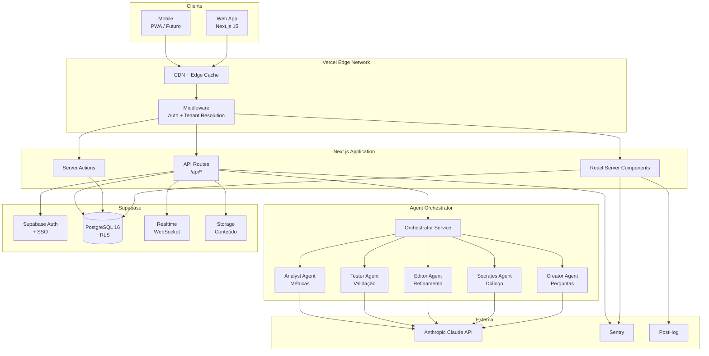
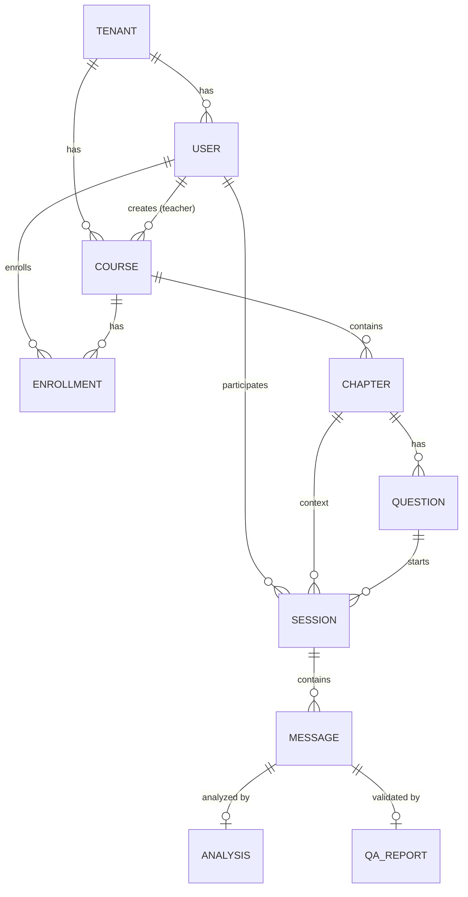
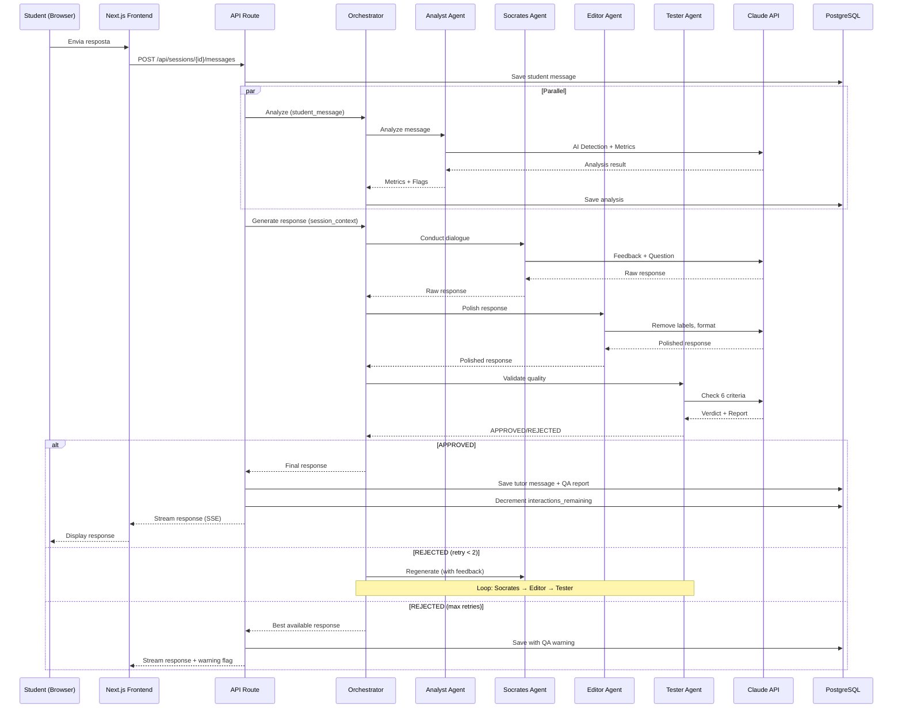

# exímIA Academy — Fullstack Architecture Document

**Versão:** 1.4
**Data:** 2026-02-08
**Autor:** Aria (Architect Agent)
**Status:** Draft — Arquitetura completa pós QA audit
**Inputs:** `docs/brief.md`, `docs/benchmark-agentes-socraticos.md`, `docs/prd.md`, `docs/screens.md`

---

## Change Log

| Data | Versão | Descrição | Autor |
|------|--------|-----------|-------|
| 2026-02-07 | 1.0 | Arquitetura inicial greenfield com recomendação de stack | Aria |
| 2026-02-07 | 1.1 | Fix 4 CRITICAL findings do QA review: RLS completo (tenant_id em todas as tabelas), streaming DataStream protocol, atomic session claim, schema completo vs PRD | Aria |
| 2026-02-07 | 1.2 | QA audit remediation (Quinn): granular RLS policies per-role, missing API routes (chapters CRUD, enrollments, questions, sessions listing), LGPD endpoints, rate limiting, NFR1 redefinition, pipeline error recovery, PRD/screens.md alignment | Aria |
| 2026-02-07 | 1.2.1 | H-1 fix: replace teacher_id with created_by in RLS policies (courses_update, sessions_select, messages_select) — column did not exist in schema | Aria |
| 2026-02-07 | 1.2.2 | H-2 fix: ADR-001 — add enrollments_student_self_enroll RLS policy for student self-enrollment in published courses | Aria |
| 2026-02-07 | 1.2.3 | Epic 3 QA fixes (Quinn/Morgan): H-1 messages_insert RLS `role='user'`→`role='student'`, H-2 add conversation history to pipeline, H-4 ADR-002 enrollment progress SECURITY DEFINER function | Aria (via Morgan) |
| 2026-02-07 | 1.3 | Epic 4 QA fixes (Quinn): H-1 add `90d` to ManagerAnalytics period params, M-2 add Recharts to tech stack | Aria |
| 2026-02-08 | 1.3.1 | Epic 3 story QA fixes (Quinn): S3.1-H1 add `get_random_active_question()` RPC (PostgREST does not support ORDER BY random()), S3.4-H1 story Dev Notes aligned with architecture (message_id FK) | Aria (via Quinn) |
| 2026-02-08 | 1.4 | Epic 6 simplification: remove dual-mode (university/corporate), platform operates exclusively in corporate mode. Remove `mode` from Tenant/Course models, SQL schema, validators, and Section 8.3. Add PLATFORM_LABELS constant. | Dex (via Epic 6) |

---

## 1. Technical Summary

A exímIA Academy é uma plataforma LMS SaaS multi-tenant que integra nativamente 6 agentes de IA socrática (validados no cliente-piloto com score 9.3/10) para transformar aprendizado passivo em aplicação prática de conhecimento.

A arquitetura segue o padrão **monorepo fullstack** com **Next.js 15** (App Router) como framework principal, **Supabase** como backend-as-a-service (PostgreSQL + Auth + Realtime + Storage), e um **Agent Orchestrator** dedicado que coordena o pipeline de 4 chamadas LLM por turno do aluno. A plataforma opera exclusivamente no modo corporativo com isolamento multi-tenant via Row-Level Security no PostgreSQL.

O design prioriza **time-to-market** (stack moderna com alto DX) sem sacrificar **escalabilidade** (serverless, edge computing, RLS nativo).

---

## 2. Platform and Infrastructure

### Recomendação: Vercel + Supabase

| Critério | Vercel + Supabase | AWS Full Stack | Self-hosted |
|----------|-------------------|----------------|-------------|
| Time-to-market | Excelente | Lento | Muito lento |
| DX (Developer Experience) | Excelente | Médio | Baixo |
| Multi-tenant (RLS) | Nativo (Supabase) | Manual | Manual |
| Real-time | Nativo (Supabase) | AppSync/WebSocket | Manual |
| Auth + SSO | Nativo (Supabase) | Cognito | Manual |
| Custo inicial | Baixo (~$25-50/mês) | Médio (~$100+/mês) | Alto (infra + DevOps) |
| Escalabilidade | Alta (serverless) | Muito alta | Depende |
| AI/LLM SDK | Vercel AI SDK | Manual | Manual |
| Lock-in risk | Médio | Alto | Baixo |

**Decisão: Vercel + Supabase**

**Rationale:**
- Next.js é framework nativo do Vercel — deploy otimizado, preview deploys, edge functions
- Supabase oferece PostgreSQL + RLS (multi-tenant nativo) + Auth (com SSO para enterprise) + Realtime + Storage num único serviço
- Vercel AI SDK simplifica streaming de respostas LLM para o chat socrático
- Custo inicial baixo permite validar MVP rapidamente
- Migração para infraestrutura dedicada é viável se necessário (PostgreSQL padrão, Next.js padrão)

**Key Services:**

| Serviço | Provider | Propósito |
|---------|----------|-----------|
| Frontend Hosting | Vercel | Next.js SSR/SSG + Edge |
| Database | Supabase (PostgreSQL) | Dados + RLS multi-tenant |
| Auth | Supabase Auth | Login, SSO, roles |
| Storage | Supabase Storage | Uploads (conteúdo, mídia) |
| Realtime | Supabase Realtime | Chat updates, notificações |
| Serverless Functions | Vercel Functions | API routes, agent orchestration |
| AI/LLM | Anthropic API (Claude) | Agentes socrático |
| Monitoring | Vercel Analytics + Sentry | Performance + errors |
| Product Analytics | PostHog | Métricas de uso |

---

## 3. Tech Stack

| Categoria | Tecnologia | Versão | Propósito | Rationale |
|-----------|-----------|--------|-----------|-----------|
| **Frontend Language** | TypeScript | 5.x | Type safety fullstack | Tipos compartilhados entre front/back, DX superior |
| **Frontend Framework** | Next.js | 15 (App Router) | SSR, RSC, Server Actions | Framework líder, Vercel-native, RSC para performance |
| **UI Components** | shadcn/ui | latest | Design system base | Componentes acessíveis, customizáveis, não é dependência (código local) |
| **CSS Framework** | Tailwind CSS | 4.x | Estilização | Utility-first, integração com shadcn, produtividade |
| **State (Server)** | TanStack Query | 5.x | Cache e sync de dados server | Padrão de mercado para server state, cache inteligente |
| **State (Client)** | Zustand | 5.x | Estado local/UI | Simples, performático, sem boilerplate |
| **Backend Language** | TypeScript | 5.x | API e serviços | Mesmo language do front = tipos compartilhados |
| **Backend Framework** | Next.js API Routes | 15 | REST endpoints | Integrado ao frontend, serverless nativo |
| **Agent Orchestrator** | Vercel AI SDK | 4.x | Pipeline de agentes LLM | Streaming nativo, suporte multi-provider, tool calling |
| **ORM** | Drizzle ORM | latest | Acesso a dados type-safe | SQL-first, performático, melhor type inference que Prisma |
| **Database** | PostgreSQL | 16 | Dados relacionais | Via Supabase, RLS nativo, maduro, extensível |
| **Cache** | Vercel KV (Redis) | - | Cache de sessões e queries | Serverless-friendly, low latency |
| **File Storage** | Supabase Storage | - | Conteúdo multimídia | Integrado, com policies por tenant |
| **Auth** | Supabase Auth | - | Autenticação + SSO | Email/password, OAuth, SAML SSO (enterprise) |
| **Realtime** | Supabase Realtime | - | Chat, notificações | WebSocket nativo, Postgres Changes |
| **AI Provider** | Anthropic Claude | claude-sonnet-4-5 | Agentes socrático | Melhor reasoning, contexto longo, custo-benefício |
| **Frontend Testing** | Vitest | 3.x | Unit tests | Rápido, compatível com Jest, ESM nativo |
| **Component Testing** | Testing Library | latest | Testes de componente | Padrão React, testa comportamento não implementação |
| **E2E Testing** | Playwright | latest | Testes end-to-end | Multi-browser, confiável, bom DX |
| **Linting** | Biome | latest | Lint + format | Substitui ESLint + Prettier, 100x mais rápido |
| **Monorepo** | Turborepo | latest | Build system | Cache inteligente, paralelismo, Vercel-native |
| **Package Manager** | pnpm | 9.x | Gerenciamento deps | Rápido, workspace-friendly, disk efficient |
| **CI/CD** | GitHub Actions | - | Pipeline de deploy | Integração Vercel + Supabase, padrão de mercado |
| **Error Tracking** | Sentry | latest | Monitoramento de erros | Fullstack (front + back), source maps, alertas |
| **Analytics** | PostHog | latest | Product analytics | Open source, self-hostable, session replay |
| **Charting** | Recharts | 2.x | Gráficos de analytics | Integrado com shadcn/ui charts, leve, composable, SSR-friendly |

---

## 4. High Level Architecture Diagram



---

## 5. Architectural Patterns

- **App Router + RSC (React Server Components):** Componentes renderizados no servidor por padrão, client components apenas onde necessário — performance superior, menos JavaScript no cliente. _Rationale:_ LMS é content-heavy, RSC reduz bundle size significativamente.

- **Server Actions para Mutations:** Formulários e mutations via Server Actions do Next.js, eliminando necessidade de API routes para CRUD simples. _Rationale:_ Menos código, type-safe end-to-end, progressive enhancement.

- **API Routes para Orquestração de Agentes:** Pipeline de agentes via API routes dedicadas com streaming (SSE). _Rationale:_ Agentes LLM precisam de orquestração complexa com retry/timeout que não cabe em Server Actions.

- **Row-Level Security (RLS) para Multi-tenant:** Isolamento de dados por tenant no nível do PostgreSQL, não da aplicação. _Rationale:_ Segurança garantida pelo banco, impossível acessar dados de outro tenant mesmo com bug no código.

- **Repository Pattern com Drizzle:** Camada de acesso a dados abstraída, queries type-safe. _Rationale:_ Testabilidade, flexibilidade para trocar banco, type inference superior.

- **Pipeline Pattern para Agent Orchestrator:** Cada agente é um step num pipeline configurável com retry, timeout e fallback. _Rationale:_ Os 6 agentes socraticos são composíveis e sequenciais — pipeline pattern modela isso naturalmente.

- **Event-Driven Analytics:** Eventos de interação aluno-IA capturados e processados assincronamente. _Rationale:_ Analytics não pode bloquear a UX; eventos permitem processamento posterior.

- **Feature Flags por Tenant:** Funcionalidades ativadas/desativadas por tenant via `tenant.settings.features`. _Rationale:_ Configuração granular por tenant sem branches de código.

---

## 6. Data Models

### 6.1 Core Entities

```typescript
// packages/shared/src/types/models.ts

// ==================== TENANT ====================
interface Tenant {
  id: string                    // UUID
  name: string                  // "Demo", "Empresa X"
  slug: string                  // "demo", "empresa-x" (usado na URL)
  branding: {
    logo_url: string
    primary_color: string
    secondary_color: string
  }
  settings: TenantSettings
  plan: 'free' | 'pro' | 'enterprise'
  created_at: Date
  updated_at: Date
}

interface TenantSettings {
  max_interactions_per_session: number  // default: 3
  ai_model: string                     // "claude-sonnet-4-5"
  features: {
    ai_detection: boolean
    learning_journal: boolean
    certificates: boolean
    analytics_dashboard: boolean
  }
}

// ==================== USER ====================
interface User {
  id: string                    // UUID (Supabase Auth)
  tenant_id: string             // FK → Tenant
  email: string
  full_name: string
  role: 'student' | 'teacher' | 'admin' | 'manager'
  profile: UserProfile
  onboarding_completed: boolean
  created_at: Date
  updated_at: Date
}

interface UserProfile {
  learning_style?: 'visual' | 'auditory' | 'reading' | 'kinesthetic'
  experience_level?: 'beginner' | 'intermediate' | 'advanced'
  goals?: string[]
  sector?: string               // Setor/área de atuação
}

// ==================== COURSE ====================
interface Course {
  id: string
  tenant_id: string
  title: string
  description: string
  status: 'draft' | 'published' | 'archived'
  created_by: string            // FK → User (teacher)
  settings: CourseSettings
  created_at: Date
  updated_at: Date
}

interface CourseSettings {
  max_interactions_per_session: number  // override do tenant
  require_completion_order: boolean
  certificate_enabled: boolean
}

// ==================== CHAPTER ====================
interface Chapter {
  id: string
  course_id: string
  tenant_id: string             // FK → Tenant (RLS — denormalized, auto-set via trigger)
  title: string
  content: string               // Conteúdo educacional (markdown/rich text)
  learning_objective: string
  order: number
  status: 'draft' | 'published'
  created_at: Date
  updated_at: Date
}

// ==================== QUESTION (gerada pelo Creator) ====================
interface Question {
  id: string
  chapter_id: string
  tenant_id: string             // FK → Tenant (RLS — denormalized, auto-set via trigger)
  text: string                  // Pergunta socrática
  skill: 'analise' | 'sintese' | 'aplicacao' | 'reflexao'
  intention: string             // Objetivo pedagógico
  expected_depth: string        // Resposta esperada (referência)
  common_shallow_answer: string // Resposta rasa típica
  followup_prompts: string[]   // Perguntas de acompanhamento
  citations: string[]           // Blocos de origem no capítulo
  status: 'pending' | 'active' | 'rejected'  // Workflow de revisão do professor
  approved_by?: string          // FK → User (teacher que aprovou)
  metadata: {
    questions_generated: number
    skills_covered: string[]
    has_practical_scenario: boolean
  }
  created_at: Date
  updated_at: Date
}

// ==================== SESSION ====================
interface Session {
  id: string
  student_id: string            // FK → User
  chapter_id: string            // FK → Chapter
  question_id: string           // FK → Question
  tenant_id: string             // FK → Tenant (RLS)
  status: 'active' | 'completed' | 'abandoned'
  interactions_remaining: number // Countdown (default: 3)
  started_at: Date
  completed_at?: Date
  updated_at: Date
}

// ==================== MESSAGE ====================
interface Message {
  id: string
  session_id: string            // FK → Session
  tenant_id: string             // FK → Tenant (RLS — denormalized, auto-set via trigger)
  role: 'student' | 'tutor'
  content: string
  turn_number: number           // 1, 2, 3 (counting UP)
  created_at: Date
}

// ==================== ANALYSIS (do Analyst) ====================
interface Analysis {
  id: string
  message_id: string            // FK → Message (mensagem do aluno)
  session_id: string
  tenant_id: string             // FK → Tenant (RLS — denormalized, auto-set via trigger)
  ai_detection: {
    probability: number         // 0.0 - 1.0
    confidence: 'low' | 'medium' | 'high'
    verdict: 'likely_human' | 'uncertain' | 'likely_ai'
    indicators: string[]
    flag?: string
  }
  metrics: {
    text: {
      chars: number
      words: number
      sentences: number
      has_question: boolean
    }
    time: {
      response_time_seconds: number
    }
    quality: {
      topic_relevance: number
      depth_of_thought: number
    }
  }
  flags: string[]
  observations: string[]
  created_at: Date
}

// ==================== QA REPORT (do Tester) ====================
interface QAReport {
  id: string
  session_id: string
  message_id: string            // FK → Message (resposta da IA)
  tenant_id: string             // FK → Tenant (RLS — denormalized, auto-set via trigger)
  verdict: 'APPROVED' | 'REJECTED'
  score: number                 // 0.0 - 1.0
  criteria_results: {
    C1_no_direct_answer: CriterionResult
    C2_open_question: CriterionResult
    C3_constructive_feedback: CriterionResult
    C4_no_labels: CriterionResult
    C5_natural_flow: CriterionResult
    C6_topic_connection: CriterionResult
  }
  recommendation: string
  created_at: Date
}

interface CriterionResult {
  passed: boolean
  severity: 'CRITICAL' | 'MAJOR' | 'MINOR'
  notes: string
}

// ==================== ENROLLMENT ====================
interface Enrollment {
  id: string
  student_id: string
  course_id: string
  tenant_id: string
  status: 'active' | 'completed' | 'dropped'
  progress: number              // 0-100%
  enrolled_at: Date
  completed_at?: Date
  updated_at: Date
}
```

### 6.2 Entity Relationship Diagram



---

## 7. Agent Orchestrator Architecture

### 7.1 Pipeline Design

O Orchestrator é o componente mais crítico — substitui o "CEO" do sistema legado.

```typescript
// packages/agents/src/orchestrator.ts

interface AgentPipelineConfig {
  maxRetries: number           // Max tentativas se Tester rejeitar (default: 2)
  timeoutMs: number            // Timeout por agente (default: 30000)
  model: string                // "claude-sonnet-4-5"
  streaming: boolean           // SSE para o frontend
}

// Pipeline de Geração de Perguntas (trigger: professor publica capítulo)
type QuestionGenerationPipeline = [
  'creator'                    // Conteúdo → Perguntas (1 chamada LLM)
]

// Pipeline de Diálogo Socrático (trigger: aluno responde)
type SocraticDialoguePipeline = [
  'analyst',                   // Msg aluno → Métricas (paralelo, 1 chamada LLM)
  'socrates',                  // Contexto + msg → Resposta bruta (1 chamada LLM)
  'editor',                    // Resposta bruta → Resposta polida (1 chamada LLM)
  'tester'                     // Resposta polida → APPROVED/REJECTED (1 chamada LLM)
  // Se REJECTED: loop socrates → editor → tester (max 2 retries)
]
```

### 7.2 Fluxo de Diálogo (Sequence Diagram)



### 7.3 Pipeline Implementation Pattern

```typescript
// packages/agents/src/pipeline.ts

import { generateText, streamText } from 'ai'
import { anthropic } from '@ai-sdk/anthropic'

interface PipelineStep<TInput, TOutput> {
  name: string
  execute: (input: TInput, context: PipelineContext) => Promise<TOutput>
  timeout: number
  retryable: boolean
}

interface PipelineContext {
  sessionId: string
  tenantId: string
  chapterContent: string
  model: string
}

// Exemplo: Step do Socrates
const socratesStep: PipelineStep<SocratesInput, SocratesOutput> = {
  name: 'socrates',
  timeout: 30000,
  retryable: true,
  execute: async (input, context) => {
    const { text } = await generateText({
      model: anthropic(context.model),
      system: SOCRATES_SYSTEM_PROMPT,     // Do 03_prompt/prompt_operacional.md
      messages: [
        {
          role: 'user',
          content: JSON.stringify({
            session_context: {
              chapter_content: context.chapterContent,
              initial_question: input.question,
              interactions_remaining: input.interactionsRemaining,
            },
            student_message: {
              content: input.studentMessage,
            },
          }),
        },
      ],
    })

    return JSON.parse(text) as SocratesOutput
  },
}
```

---

## 8. Multi-Tenant Architecture

### 8.1 Estratégia: Row-Level Security (RLS)

**Todas** as tabelas têm coluna `tenant_id` (denormalized via triggers para tabelas filhas). O PostgreSQL garante isolamento no nível do banco.

A helper function `auth_tenant_id()` (SECURITY DEFINER, STABLE) é usada em todas as policies para evitar repetição e garantir consistência:

```sql
-- Helper function (definida uma vez, usada em todas as policies)
CREATE OR REPLACE FUNCTION auth_tenant_id() RETURNS UUID AS $$
  SELECT tenant_id FROM users WHERE id = auth.uid();
$$ LANGUAGE sql SECURITY DEFINER STABLE;

-- Tenant isolation aplicada a TODAS as 9 tabelas:
CREATE POLICY tenant_isolation ON users        FOR ALL USING (tenant_id = auth_tenant_id());
CREATE POLICY tenant_isolation ON courses      FOR ALL USING (tenant_id = auth_tenant_id());
CREATE POLICY tenant_isolation ON chapters     FOR ALL USING (tenant_id = auth_tenant_id());
CREATE POLICY tenant_isolation ON questions    FOR ALL USING (tenant_id = auth_tenant_id());
CREATE POLICY tenant_isolation ON enrollments  FOR ALL USING (tenant_id = auth_tenant_id());
CREATE POLICY tenant_isolation ON sessions     FOR ALL USING (tenant_id = auth_tenant_id());
CREATE POLICY tenant_isolation ON messages     FOR ALL USING (tenant_id = auth_tenant_id());
CREATE POLICY tenant_isolation ON analyses     FOR ALL USING (tenant_id = auth_tenant_id());
CREATE POLICY tenant_isolation ON qa_reports   FOR ALL USING (tenant_id = auth_tenant_id());

-- Role-based policies (alunos só veem seus próprios dados)
-- Ver schema completo em seção 10.3
```

> **Nota:** Tabelas filhas (`chapters`, `questions`, `messages`, `analyses`, `qa_reports`) recebem `tenant_id` automaticamente via triggers `BEFORE INSERT` que copiam do parent. Ver seção 10.3 para SQL completo.

### 8.2 Tenant Resolution

```typescript
// apps/web/src/middleware.ts

import { NextResponse } from 'next/server'
import type { NextRequest } from 'next/server'

export function middleware(request: NextRequest) {
  // Estratégia 1: Subdomain (demo.eximia.academy)
  const hostname = request.headers.get('host') || ''
  const subdomain = hostname.split('.')[0]

  // Estratégia 2: Path prefix (/t/demo/...)
  // const tenantSlug = request.nextUrl.pathname.split('/')[2]

  // Injetar tenant_id no header para Server Components
  const response = NextResponse.next()
  response.headers.set('x-tenant-slug', subdomain)
  return response
}
```

---

## 9. Frontend Architecture

### 9.1 Component Organization

```
apps/web/src/
├── app/                          # Next.js App Router
│   ├── (auth)/                   # Group: páginas de auth
│   │   ├── login/
│   │   ├── accept-invite/        # ARCH-3 FIX: invite-only (no self-registration)
│   │   └── layout.tsx
│   ├── (platform)/               # Group: plataforma autenticada
│   │   ├── dashboard/            # Dashboard (por role)
│   │   ├── courses/              # Listagem e detalhes de cursos
│   │   │   └── [courseId]/
│   │   │       ├── page.tsx      # Visão geral do curso
│   │   │       └── chapters/
│   │   │           └── [chapterId]/
│   │   │               ├── page.tsx      # Conteúdo do capítulo
│   │   │               └── session/
│   │   │                   └── page.tsx  # Chat socrático
│   │   ├── analytics/            # Dashboards de métricas
│   │   ├── admin/                # Gestão do tenant
│   │   └── layout.tsx            # Layout com sidebar + tenant branding
│   ├── api/                      # API Routes
│   │   ├── sessions/
│   │   │   └── [sessionId]/
│   │   │       └── messages/
│   │   │           └── route.ts  # POST: Agent Orchestrator
│   │   ├── courses/
│   │   ├── chapters/
│   │   │   └── [chapterId]/
│   │   │       └── generate-questions/
│   │   │           └── route.ts  # POST: Creator Agent
│   │   └── webhooks/
│   ├── globals.css
│   └── layout.tsx                # Root layout
├── components/
│   ├── ui/                       # shadcn/ui components
│   ├── chat/                     # Chat socrático
│   │   ├── chat-container.tsx
│   │   ├── chat-message.tsx
│   │   ├── chat-input.tsx
│   │   └── interaction-counter.tsx
│   ├── course/                   # Componentes de curso
│   ├── dashboard/                # Widgets de dashboard
│   └── layout/                   # Header, sidebar, footer
├── hooks/
│   ├── use-session.ts            # Hook do chat socrático
│   ├── use-tenant.ts             # Contexto do tenant
│   └── use-auth.ts               # Estado de autenticação
├── lib/
│   ├── supabase/
│   │   ├── client.ts             # Browser client
│   │   ├── server.ts             # Server client
│   │   └── middleware.ts         # Auth middleware
│   ├── agents/
│   │   └── client.ts             # Client para Agent Orchestrator
│   └── utils.ts
└── styles/
    └── themes/                   # Temas por tenant
```

### 9.2 Chat Socrático — Componente Principal

```typescript
// apps/web/src/components/chat/chat-container.tsx
'use client'

import { useChat } from 'ai/react'
import { ChatMessage } from './chat-message'
import { ChatInput } from './chat-input'
import { InteractionCounter } from './interaction-counter'

interface SocraticChatProps {
  sessionId: string
  initialQuestion: string
  maxInteractions: number
}

export function SocraticChat({
  sessionId,
  initialQuestion,
  maxInteractions,
}: SocraticChatProps) {
  const { messages, input, handleInputChange, handleSubmit, isLoading } =
    useChat({
      api: `/api/sessions/${sessionId}/messages`,
      initialMessages: [
        {
          id: 'initial',
          role: 'assistant',
          content: initialQuestion,
        },
      ],
    })

  const turnsUsed = messages.filter((m) => m.role === 'user').length
  const turnsRemaining = maxInteractions - turnsUsed
  const sessionComplete = turnsRemaining <= 0

  return (
    <div className="flex flex-col h-full">
      <InteractionCounter
        remaining={turnsRemaining}
        total={maxInteractions}
      />

      <div className="flex-1 overflow-y-auto space-y-4 p-4">
        {messages.map((message) => (
          <ChatMessage key={message.id} message={message} />
        ))}
      </div>

      {!sessionComplete && (
        <ChatInput
          input={input}
          onChange={handleInputChange}
          onSubmit={handleSubmit}
          isLoading={isLoading}
          placeholder="Escreva sua reflexão..."
        />
      )}

      {sessionComplete && (
        <div className="p-4 text-center text-muted-foreground">
          Sessão concluída. Revise suas reflexões no Learning Journal.
        </div>
      )}
    </div>
  )
}
```

### 9.3 State Management

```typescript
// Server State (TanStack Query) — maioria dos dados
// Cursos, capítulos, sessões, analytics = tudo via React Query
// Cache automático, invalidação, prefetch

// Client State (Zustand) — apenas UI local
import { create } from 'zustand'

interface UIStore {
  sidebarOpen: boolean
  toggleSidebar: () => void
  activeModal: string | null
  openModal: (id: string) => void
  closeModal: () => void
}

export const useUIStore = create<UIStore>((set) => ({
  sidebarOpen: true,
  toggleSidebar: () => set((s) => ({ sidebarOpen: !s.sidebarOpen })),
  activeModal: null,
  openModal: (id) => set({ activeModal: id }),
  closeModal: () => set({ activeModal: null }),
}))
```

### 9.4 Protected Routes

```typescript
// apps/web/src/app/(platform)/layout.tsx
import { redirect } from 'next/navigation'
import { createServerClient } from '@/lib/supabase/server'

export default async function PlatformLayout({
  children,
}: {
  children: React.ReactNode
}) {
  const supabase = await createServerClient()
  const { data: { user } } = await supabase.auth.getUser()

  if (!user) redirect('/login')

  const { data: profile } = await supabase
    .from('users')
    .select('*, tenant:tenants(*)')
    .eq('id', user.id)
    .single()

  if (!profile) redirect('/onboarding')

  return (
    <TenantProvider tenant={profile.tenant}>
      <div className="flex h-screen">
        <Sidebar role={profile.role} />
        <main className="flex-1 overflow-auto">{children}</main>
      </div>
    </TenantProvider>
  )
}
```

---

## 10. Backend Architecture

### 10.1 API Routes Structure

```
apps/web/src/app/api/
├── auth/
│   └── callback/route.ts              # Supabase Auth callback
├── courses/
│   ├── route.ts                       # GET (list by role), POST (create — teacher)
│   └── [courseId]/
│       ├── route.ts                   # GET, PATCH, DELETE
│       ├── publish/route.ts           # POST (publish course — teacher)
│       ├── enroll/route.ts            # POST (enroll student)
│       └── chapters/
│           └── route.ts               # GET (list chapters), POST (create chapter — teacher)
├── chapters/
│   └── [chapterId]/
│       ├── route.ts                   # GET, PATCH, DELETE (teacher)
│       ├── generate-questions/
│       │   └── route.ts              # POST → Creator Agent Pipeline (teacher)
│       └── questions/
│           └── route.ts              # GET (list questions for chapter)
├── questions/
│   └── [questionId]/
│       └── route.ts                   # PATCH (approve/reject/edit — teacher), DELETE
├── enrollments/
│   ├── route.ts                       # GET (student's enrollments with progress)
│   └── [enrollmentId]/
│       └── route.ts                   # PATCH (update progress), DELETE (drop)
├── sessions/
│   ├── route.ts                       # GET (list student sessions), POST (start session)
│   └── [sessionId]/
│       ├── route.ts                   # GET (session status + messages)
│       └── messages/
│           └── route.ts              # POST → Socratic Dialogue Pipeline (streaming)
├── analytics/
│   ├── student/route.ts               # GET → { summary, courses, recentSessions }
│   ├── teacher/route.ts               # GET → { summary, courses[], studentMetrics[] }
│   └── manager/route.ts              # GET → { summary, engagementChart, courseTable[] }
├── admin/
│   ├── tenants/route.ts               # GET, PATCH (settings, branding)
│   └── users/
│       ├── route.ts                   # GET (paginated, filterable), POST (invite)
│       └── [userId]/
│           └── route.ts              # PATCH (role, status), DELETE (deactivate)
└── privacy/
    ├── export/route.ts                # GET → LGPD data export (DSAR)
    └── delete/route.ts                # DELETE → LGPD right to erasure
```

> **v1.2 fixes:** Added chapters CRUD under courses, enrollments endpoints, questions CRUD, sessions listing, analytics response shapes, admin user management, and LGPD privacy endpoints.
>
> **ARCH-3 alignment (PRD Story 1.3 vs screens.md):** A plataforma opera exclusivamente no modelo **invite-only**. Não há self-registration. O fluxo é: Admin cria convite via `POST /api/admin/users` → email com magic link → aluno acessa `/accept-invite` → completa onboarding. A referência a `/register` no PRD Story 1.3 AC#2 deve ser interpretada como `/accept-invite` (aceitar convite).

### 10.1.1 Analytics Endpoint Contracts

```typescript
// GET /api/analytics/student
interface StudentAnalytics {
  summary: {
    enrolledCourses: number
    completedSessions: number
    completedChapters: number
  }
  courses: Array<{
    courseId: string
    title: string
    progress: number          // 0-100
    lastAccessedAt: string
  }>
  recentSessions: Array<{
    sessionId: string
    chapterTitle: string
    status: 'active' | 'completed'
    completedAt?: string
  }>
}

// GET /api/analytics/teacher?period=7d|30d|all
interface TeacherAnalytics {
  summary: {
    totalCourses: number
    totalStudents: number
    sessionsThisWeek: number
  }
  courses: Array<{
    courseId: string
    title: string
    studentCount: number
    completionRate: number    // 0-100
    sessionCount: number
    status: string
  }>
  // Expandable per course
  studentMetrics?: Array<{
    studentId: string
    name: string
    progress: number
    sessionCount: number
    lastActivity: string
    aiDetectionFlags: Array<{ verdict: string; confidence: string }>
  }>
}

// GET /api/analytics/manager?period=7d|30d|90d|all&courseId=optional
interface ManagerAnalytics {
  summary: {
    activeStudents: number
    engagementRate: number    // 0-100
    completionRate: number    // 0-100
    sessionsThisMonth: number
  }
  engagementChart: Array<{   // Time series for line chart
    week: string             // ISO week
    sessions: number
  }>
  courseTable: Array<{
    courseId: string
    title: string
    studentCount: number
    completionRate: number
    avgReflectionDepth: number
    avgAiDetection: number   // % likely_human
  }>
}
```

### 10.2 API Route — Socratic Dialogue (Streaming + Atomic Claim)

> **Fixes aplicados:** C1 (streaming via DataStream protocol), C2 (atomic claim via `claim_session_turn` RPC), H2 (turn_number conta UP: 1→2→3).

```typescript
// apps/web/src/app/api/sessions/[sessionId]/messages/route.ts

import { createServerClient } from '@/lib/supabase/server'
import { orchestrateSocraticDialogue, runAnalyst } from '@eximia/agents'

export async function POST(
  request: Request,
  { params }: { params: { sessionId: string } }
) {
  const supabase = await createServerClient()
  const { data: { user } } = await supabase.auth.getUser()
  if (!user) return Response.json({ error: 'Unauthorized' }, { status: 401 })

  const { content, response_time_seconds } = await request.json()
  const { sessionId } = params

  // ── STEP 1: Atomic session claim (C2 FIX) ──────────────────────
  // Single UPDATE...WHERE...RETURNING atomically:
  //   - Validates session is active + owned by user
  //   - Decrements interactions_remaining
  //   - Sets status to 'completed' if counter hits 0
  // If two requests arrive simultaneously, only one succeeds (409 for the other).
  const { data: claimed, error } = await supabase.rpc('claim_session_turn', {
    p_session_id: sessionId,
    p_user_id: user.id,
  })

  if (error || !claimed?.[0]) {
    return Response.json({ error: 'Session not available' }, { status: 409 })
  }

  const turn = claimed[0]
  // turn.turn_number = 1, 2, 3 (counting UP — H2 FIX)
  // turn.interactions_remaining = already decremented (2, 1, 0)

  // ── STEP 2–6 wrapped in try/catch for pipeline error recovery ──
  // If the pipeline fails AFTER claim_session_turn, we must release the turn
  // to avoid permanently losing an interaction.
  try {
    // ── STEP 2: Load full context (v1.2.3 FIX: includes previous messages) ─
    const { data: session } = await supabase
      .from('sessions')
      .select('*, chapter:chapters(*), question:questions(*)')
      .eq('id', sessionId)
      .single()

    // Load conversation history for turns 2 and 3 (H-2 FIX)
    const { data: previousMessages } = await supabase
      .from('messages')
      .select('role, content, turn_number')
      .eq('session_id', sessionId)
      .order('turn_number', { ascending: true })
      .order('created_at', { ascending: true })

    // ── STEP 3: Save student message ───────────────────────────────
    const { data: studentMsg } = await supabase
      .from('messages')
      .insert({
        session_id: sessionId,
        role: 'student',
        content,
        turn_number: turn.turn_number,
      })
      .select()
      .single()

    // ── STEP 4: Analyst in parallel (non-blocking) ─────────────────
    const analysisPromise = runAnalyst({
      studentMessage: content,
      chapterId: session!.chapter.id,
      turnNumber: turn.turn_number,
      responseTimeSeconds: response_time_seconds,
      model: 'claude-sonnet-4-5-20250929',
    })

    // ── STEP 5: Pipeline: Socrates → Editor → Tester (with retry) ─
    const result = await orchestrateSocraticDialogue({
      sessionId,
      studentMessage: content,
      chapterContent: session!.chapter.content,
      question: session!.question,
      conversationHistory: previousMessages || [], // H-2 FIX: Socrates needs context from previous turns
      turnNumber: turn.turn_number,
      interactionsRemaining: turn.interactions_remaining,
      model: 'claude-sonnet-4-5-20250929',
    })

    // ── STEP 6: Persist results ────────────────────────────────────
    const analysis = await analysisPromise

    await Promise.all([
      supabase.from('messages').insert({
        session_id: sessionId,
        role: 'tutor',
        content: result.response,
        turn_number: turn.turn_number,
      }),
      supabase.from('analyses').insert({
        message_id: studentMsg!.id,
        session_id: sessionId,
        ai_detection: analysis.aiDetection,
        metrics: analysis.metrics,
        flags: analysis.flags,
        observations: analysis.observations,
      }),
      supabase.from('qa_reports').insert({
        session_id: sessionId,
        message_id: studentMsg!.id,
        verdict: result.qaReport.verdict,
        score: result.qaReport.score,
        criteria_results: result.qaReport.criteriaResults,
        recommendation: result.qaReport.recommendation,
      }),
    ])
  } catch (pipelineError) {
    // ── ERROR RECOVERY: release the claimed turn ─────────────────
    // Compensation: restore interactions_remaining so the student can retry.
    await supabase.rpc('release_session_turn', {
      p_session_id: sessionId,
      p_user_id: user.id,
    })

    console.error(`Pipeline failed for session ${sessionId}:`, pipelineError)
    return Response.json(
      { error: { code: 'PIPELINE_FAILED', message: 'Erro no processamento. Tente novamente.' } },
      { status: 502 }
    )
  }

  // ── STEP 7: Stream response (C1 FIX) ──────────────────────────
  // Vercel AI SDK DataStream protocol for useChat() compatibility.
  // Text is streamed in word chunks for natural typing feel.
  const encoder = new TextEncoder()
  const stream = new ReadableStream({
    async start(controller) {
      // Stream text in word-sized chunks (protocol: 0:"text"\n)
      const words = result.response.split(/(?<=\s)/)
      for (const word of words) {
        controller.enqueue(encoder.encode(`0:${JSON.stringify(word)}\n`))
        await new Promise((r) => setTimeout(r, 25))
      }
      // Send session metadata as data annotation (protocol: 2:[data]\n)
      controller.enqueue(
        encoder.encode(
          `2:${JSON.stringify([{
            session_status: turn.interactions_remaining <= 0 ? 'completed' : 'active',
            interactions_remaining: turn.interactions_remaining,
            turn_number: turn.turn_number,
          }])}\n`
        )
      )
      controller.close()
    },
  })

  return new Response(stream, {
    headers: {
      'Content-Type': 'text/plain; charset=utf-8',
      'X-Vercel-AI-Data-Stream': 'v1',
    },
  })
}
```

### 10.3 Database Schema (SQL)

```sql
-- ==================== TENANTS ====================
CREATE TABLE tenants (
  id UUID PRIMARY KEY DEFAULT gen_random_uuid(),
  name TEXT NOT NULL,
  slug TEXT UNIQUE NOT NULL,
  branding JSONB DEFAULT '{}',
  settings JSONB DEFAULT '{"max_interactions_per_session": 3}',
  plan TEXT NOT NULL DEFAULT 'free' CHECK (plan IN ('free', 'pro', 'enterprise')),
  created_at TIMESTAMPTZ DEFAULT NOW(),
  updated_at TIMESTAMPTZ DEFAULT NOW()
);

-- ==================== USERS ====================
CREATE TABLE users (
  id UUID PRIMARY KEY REFERENCES auth.users(id) ON DELETE CASCADE,
  tenant_id UUID NOT NULL REFERENCES tenants(id),
  email TEXT NOT NULL,
  full_name TEXT NOT NULL,
  role TEXT NOT NULL CHECK (role IN ('student', 'teacher', 'admin', 'manager')),
  profile JSONB DEFAULT '{}',
  onboarding_completed BOOLEAN DEFAULT FALSE,
  created_at TIMESTAMPTZ DEFAULT NOW(),
  updated_at TIMESTAMPTZ DEFAULT NOW()
);

-- ==================== COURSES ====================
CREATE TABLE courses (
  id UUID PRIMARY KEY DEFAULT gen_random_uuid(),
  tenant_id UUID NOT NULL REFERENCES tenants(id),
  title TEXT NOT NULL,
  description TEXT,
  status TEXT NOT NULL DEFAULT 'draft' CHECK (status IN ('draft', 'published', 'archived')),
  created_by UUID NOT NULL REFERENCES users(id),
  settings JSONB DEFAULT '{}',
  created_at TIMESTAMPTZ DEFAULT NOW(),
  updated_at TIMESTAMPTZ DEFAULT NOW()
);

-- ==================== CHAPTERS ==================== [C3 FIX: added tenant_id]
CREATE TABLE chapters (
  id UUID PRIMARY KEY DEFAULT gen_random_uuid(),
  course_id UUID NOT NULL REFERENCES courses(id) ON DELETE CASCADE,
  tenant_id UUID NOT NULL REFERENCES tenants(id),
  title TEXT NOT NULL,
  content TEXT NOT NULL,
  learning_objective TEXT,
  "order" INTEGER NOT NULL,
  status TEXT NOT NULL DEFAULT 'draft' CHECK (status IN ('draft', 'published')),
  created_at TIMESTAMPTZ DEFAULT NOW(),
  updated_at TIMESTAMPTZ DEFAULT NOW()
);

-- ==================== QUESTIONS (Creator Agent output) ==================== [C3+C4 FIX: added tenant_id, status, approved_by]
CREATE TABLE questions (
  id UUID PRIMARY KEY DEFAULT gen_random_uuid(),
  chapter_id UUID NOT NULL REFERENCES chapters(id) ON DELETE CASCADE,
  tenant_id UUID NOT NULL REFERENCES tenants(id),
  text TEXT NOT NULL,
  skill TEXT NOT NULL CHECK (skill IN ('analise', 'sintese', 'aplicacao', 'reflexao')),
  intention TEXT NOT NULL,
  expected_depth TEXT,
  common_shallow_answer TEXT,
  followup_prompts JSONB DEFAULT '[]',
  citations JSONB DEFAULT '[]',
  status TEXT NOT NULL DEFAULT 'pending' CHECK (status IN ('pending', 'active', 'rejected')),
  approved_by UUID REFERENCES users(id),
  metadata JSONB DEFAULT '{}',
  created_at TIMESTAMPTZ DEFAULT NOW(),
  updated_at TIMESTAMPTZ DEFAULT NOW()
);

-- ==================== ENROLLMENTS ====================
CREATE TABLE enrollments (
  id UUID PRIMARY KEY DEFAULT gen_random_uuid(),
  student_id UUID NOT NULL REFERENCES users(id),
  course_id UUID NOT NULL REFERENCES courses(id),
  tenant_id UUID NOT NULL REFERENCES tenants(id),
  status TEXT NOT NULL DEFAULT 'active' CHECK (status IN ('active', 'completed', 'dropped')),
  progress NUMERIC(5,2) DEFAULT 0 CHECK (progress >= 0 AND progress <= 100),
  enrolled_at TIMESTAMPTZ DEFAULT NOW(),
  completed_at TIMESTAMPTZ,
  updated_at TIMESTAMPTZ DEFAULT NOW(),
  UNIQUE(student_id, course_id)
);

-- ==================== SESSIONS ====================
CREATE TABLE sessions (
  id UUID PRIMARY KEY DEFAULT gen_random_uuid(),
  student_id UUID NOT NULL REFERENCES users(id),
  chapter_id UUID NOT NULL REFERENCES chapters(id),
  question_id UUID NOT NULL REFERENCES questions(id),
  tenant_id UUID NOT NULL REFERENCES tenants(id),
  status TEXT NOT NULL DEFAULT 'active' CHECK (status IN ('active', 'completed', 'abandoned')),
  interactions_remaining INTEGER NOT NULL DEFAULT 3,
  started_at TIMESTAMPTZ DEFAULT NOW(),
  completed_at TIMESTAMPTZ,
  updated_at TIMESTAMPTZ DEFAULT NOW()
);

-- ==================== MESSAGES ==================== [C3 FIX: added tenant_id]
CREATE TABLE messages (
  id UUID PRIMARY KEY DEFAULT gen_random_uuid(),
  session_id UUID NOT NULL REFERENCES sessions(id) ON DELETE CASCADE,
  tenant_id UUID NOT NULL REFERENCES tenants(id),
  role TEXT NOT NULL CHECK (role IN ('student', 'tutor')),
  content TEXT NOT NULL,
  turn_number INTEGER NOT NULL,
  created_at TIMESTAMPTZ DEFAULT NOW()
);

-- ==================== ANALYSES (Analyst Agent output) ==================== [C3 FIX: added tenant_id]
CREATE TABLE analyses (
  id UUID PRIMARY KEY DEFAULT gen_random_uuid(),
  message_id UUID NOT NULL REFERENCES messages(id) ON DELETE CASCADE,
  session_id UUID NOT NULL REFERENCES sessions(id),
  tenant_id UUID NOT NULL REFERENCES tenants(id),
  ai_detection JSONB NOT NULL,
  metrics JSONB NOT NULL,
  flags JSONB DEFAULT '[]',
  observations JSONB DEFAULT '[]',
  created_at TIMESTAMPTZ DEFAULT NOW()
);

-- ==================== QA REPORTS (Tester Agent output) ==================== [C3 FIX: added tenant_id]
CREATE TABLE qa_reports (
  id UUID PRIMARY KEY DEFAULT gen_random_uuid(),
  session_id UUID NOT NULL REFERENCES sessions(id),
  message_id UUID NOT NULL REFERENCES messages(id),
  tenant_id UUID NOT NULL REFERENCES tenants(id),
  verdict TEXT NOT NULL CHECK (verdict IN ('APPROVED', 'REJECTED')),
  score NUMERIC(3,2) NOT NULL,
  criteria_results JSONB NOT NULL,
  recommendation TEXT,
  created_at TIMESTAMPTZ DEFAULT NOW()
);

-- ==================== ATOMIC SESSION CLAIM (C2 FIX) ====================
-- Prevents race condition: atomically claims a turn before pipeline processing.
-- Returns NULL if session is invalid, completed, or not owned by user.
-- SEC-5 FIX: Added tenant_id validation to prevent cross-tenant session hijacking
CREATE OR REPLACE FUNCTION claim_session_turn(
  p_session_id UUID,
  p_user_id UUID
) RETURNS TABLE (
  session_id UUID,
  chapter_id UUID,
  question_id UUID,
  tenant_id UUID,
  interactions_remaining INTEGER,
  turn_number INTEGER
) AS $$
DECLARE
  v_caller_tenant UUID;
BEGIN
  -- Validate caller's tenant matches session's tenant
  SELECT u.tenant_id INTO v_caller_tenant FROM users u WHERE u.id = p_user_id;
  IF v_caller_tenant IS NULL THEN
    RETURN; -- User not found
  END IF;

  RETURN QUERY
  UPDATE sessions s
  SET
    interactions_remaining = s.interactions_remaining - 1,
    status = CASE WHEN s.interactions_remaining - 1 <= 0 THEN 'completed' ELSE 'active' END,
    completed_at = CASE WHEN s.interactions_remaining - 1 <= 0 THEN NOW() ELSE NULL END,
    updated_at = NOW()
  WHERE s.id = p_session_id
    AND s.student_id = p_user_id
    AND s.tenant_id = v_caller_tenant    -- SEC-5: cross-tenant check
    AND s.status = 'active'
    AND s.interactions_remaining > 0
  RETURNING
    s.id AS session_id,
    s.chapter_id,
    s.question_id,
    s.tenant_id,
    s.interactions_remaining,
    (SELECT COALESCE((t.settings->>'max_interactions_per_session')::int, 3)
     FROM tenants t WHERE t.id = s.tenant_id) - s.interactions_remaining AS turn_number;
END;
$$ LANGUAGE plpgsql SECURITY DEFINER;

-- ==================== PIPELINE ERROR RECOVERY ====================
-- Compensation function: if the agent pipeline fails AFTER claim_session_turn
-- succeeded, we must restore the decremented interaction count.
CREATE OR REPLACE FUNCTION release_session_turn(
  p_session_id UUID,
  p_user_id UUID
) RETURNS BOOLEAN AS $$
DECLARE
  v_caller_tenant UUID;
BEGIN
  SELECT u.tenant_id INTO v_caller_tenant FROM users u WHERE u.id = p_user_id;
  IF v_caller_tenant IS NULL THEN
    RETURN FALSE;
  END IF;

  UPDATE sessions s
  SET
    interactions_remaining = s.interactions_remaining + 1,
    status = 'active',
    completed_at = NULL,
    updated_at = NOW()
  WHERE s.id = p_session_id
    AND s.student_id = p_user_id
    AND s.tenant_id = v_caller_tenant
    AND s.interactions_remaining < (
      SELECT COALESCE((t.settings->>'max_interactions_per_session')::int, 3)
      FROM tenants t WHERE t.id = s.tenant_id
    );

  RETURN FOUND;
END;
$$ LANGUAGE plpgsql SECURITY DEFINER;

-- ==================== ENROLLMENT PROGRESS UPDATE (ADR-002, v1.2.3) ====================
-- SECURITY DEFINER function to get a random active question for a chapter.
-- PostgREST does not support ORDER BY random() — this RPC provides server-side randomization.
CREATE OR REPLACE FUNCTION get_random_active_question(
  p_chapter_id UUID
) RETURNS TABLE (
  id UUID,
  chapter_id UUID,
  content TEXT,
  status TEXT,
  tenant_id UUID
) AS $$
BEGIN
  RETURN QUERY
  SELECT q.id, q.chapter_id, q.content, q.status, q.tenant_id
  FROM questions q
  WHERE q.chapter_id = p_chapter_id
    AND q.status = 'active'
  ORDER BY random()
  LIMIT 1;
END;
$$ LANGUAGE plpgsql SECURITY DEFINER;

-- SECURITY DEFINER function to allow students to update their own enrollment progress
-- after completing socratic sessions. Direct UPDATE blocked by enrollments_update RLS
-- (teacher/admin only). This function validates ownership before updating.
CREATE OR REPLACE FUNCTION update_enrollment_progress(
  p_student_id UUID,
  p_course_id UUID
) RETURNS TABLE (
  enrollment_id UUID,
  new_progress NUMERIC(5,2),
  new_status TEXT
) AS $$
DECLARE
  v_caller_tenant UUID;
  v_total_chapters INTEGER;
  v_completed_chapters INTEGER;
  v_progress NUMERIC(5,2);
  v_status TEXT;
BEGIN
  -- Validate caller's tenant
  SELECT u.tenant_id INTO v_caller_tenant FROM users u WHERE u.id = p_student_id;
  IF v_caller_tenant IS NULL THEN
    RETURN;
  END IF;

  -- Count total published chapters in course
  SELECT COUNT(*) INTO v_total_chapters
  FROM chapters ch
  WHERE ch.course_id = p_course_id
    AND ch.status = 'published'
    AND ch.tenant_id = v_caller_tenant;

  IF v_total_chapters = 0 THEN
    RETURN;
  END IF;

  -- Count chapters with at least one completed session for this student
  SELECT COUNT(DISTINCT s.chapter_id) INTO v_completed_chapters
  FROM sessions s
  JOIN chapters ch ON ch.id = s.chapter_id
  WHERE s.student_id = p_student_id
    AND s.status = 'completed'
    AND ch.course_id = p_course_id
    AND s.tenant_id = v_caller_tenant;

  -- Calculate progress
  v_progress := ROUND((v_completed_chapters::NUMERIC / v_total_chapters) * 100, 2);
  v_status := CASE WHEN v_progress >= 100 THEN 'completed' ELSE 'active' END;

  -- Update enrollment
  RETURN QUERY
  UPDATE enrollments e
  SET
    progress = v_progress,
    status = v_status,
    completed_at = CASE WHEN v_progress >= 100 THEN NOW() ELSE NULL END,
    updated_at = NOW()
  WHERE e.student_id = p_student_id
    AND e.course_id = p_course_id
    AND e.tenant_id = v_caller_tenant
  RETURNING
    e.id AS enrollment_id,
    e.progress AS new_progress,
    e.status AS new_status;
END;
$$ LANGUAGE plpgsql SECURITY DEFINER;

-- ==================== AUTO-POPULATE tenant_id TRIGGERS ====================
-- Child tables inherit tenant_id from their parent automatically.
-- This ensures tenant_id is always consistent without manual assignment.

CREATE OR REPLACE FUNCTION set_chapter_tenant_id() RETURNS TRIGGER AS $$
BEGIN
  NEW.tenant_id := (SELECT tenant_id FROM courses WHERE id = NEW.course_id);
  RETURN NEW;
END;
$$ LANGUAGE plpgsql;
CREATE TRIGGER trg_chapters_tenant_id
  BEFORE INSERT ON chapters FOR EACH ROW EXECUTE FUNCTION set_chapter_tenant_id();

CREATE OR REPLACE FUNCTION set_question_tenant_id() RETURNS TRIGGER AS $$
BEGIN
  NEW.tenant_id := (SELECT tenant_id FROM chapters WHERE id = NEW.chapter_id);
  RETURN NEW;
END;
$$ LANGUAGE plpgsql;
CREATE TRIGGER trg_questions_tenant_id
  BEFORE INSERT ON questions FOR EACH ROW EXECUTE FUNCTION set_question_tenant_id();

CREATE OR REPLACE FUNCTION set_child_tenant_from_session() RETURNS TRIGGER AS $$
BEGIN
  NEW.tenant_id := (SELECT tenant_id FROM sessions WHERE id = NEW.session_id);
  RETURN NEW;
END;
$$ LANGUAGE plpgsql;
CREATE TRIGGER trg_messages_tenant_id
  BEFORE INSERT ON messages FOR EACH ROW EXECUTE FUNCTION set_child_tenant_from_session();
CREATE TRIGGER trg_analyses_tenant_id
  BEFORE INSERT ON analyses FOR EACH ROW EXECUTE FUNCTION set_child_tenant_from_session();
CREATE TRIGGER trg_qa_reports_tenant_id
  BEFORE INSERT ON qa_reports FOR EACH ROW EXECUTE FUNCTION set_child_tenant_from_session();

-- ==================== AUTO updated_at ====================
CREATE OR REPLACE FUNCTION update_updated_at() RETURNS TRIGGER AS $$
BEGIN NEW.updated_at = NOW(); RETURN NEW; END;
$$ LANGUAGE plpgsql;

CREATE TRIGGER trg_tenants_updated BEFORE UPDATE ON tenants FOR EACH ROW EXECUTE FUNCTION update_updated_at();
CREATE TRIGGER trg_users_updated BEFORE UPDATE ON users FOR EACH ROW EXECUTE FUNCTION update_updated_at();
CREATE TRIGGER trg_courses_updated BEFORE UPDATE ON courses FOR EACH ROW EXECUTE FUNCTION update_updated_at();
CREATE TRIGGER trg_chapters_updated BEFORE UPDATE ON chapters FOR EACH ROW EXECUTE FUNCTION update_updated_at();
CREATE TRIGGER trg_questions_updated BEFORE UPDATE ON questions FOR EACH ROW EXECUTE FUNCTION update_updated_at();
CREATE TRIGGER trg_enrollments_updated BEFORE UPDATE ON enrollments FOR EACH ROW EXECUTE FUNCTION update_updated_at();
CREATE TRIGGER trg_sessions_updated BEFORE UPDATE ON sessions FOR EACH ROW EXECUTE FUNCTION update_updated_at();

-- ==================== INDEXES ====================
CREATE INDEX idx_users_tenant ON users(tenant_id);
CREATE INDEX idx_courses_tenant ON courses(tenant_id);
CREATE INDEX idx_chapters_course ON chapters(course_id);
CREATE INDEX idx_chapters_tenant ON chapters(tenant_id);
CREATE INDEX idx_questions_chapter ON questions(chapter_id);
CREATE INDEX idx_questions_tenant ON questions(tenant_id);
CREATE INDEX idx_questions_active ON questions(chapter_id, status) WHERE status = 'active';
CREATE INDEX idx_enrollments_student ON enrollments(student_id);
CREATE INDEX idx_enrollments_tenant ON enrollments(tenant_id);
CREATE INDEX idx_sessions_student ON sessions(student_id);
CREATE INDEX idx_sessions_tenant ON sessions(tenant_id);
CREATE INDEX idx_sessions_active ON sessions(student_id, chapter_id) WHERE status = 'active';
CREATE INDEX idx_messages_session ON messages(session_id);
CREATE INDEX idx_messages_tenant ON messages(tenant_id);
CREATE INDEX idx_analyses_session ON analyses(session_id);
CREATE INDEX idx_analyses_tenant ON analyses(tenant_id);
CREATE INDEX idx_qa_reports_session ON qa_reports(session_id);
CREATE INDEX idx_qa_reports_tenant ON qa_reports(tenant_id);

-- ==================== RLS POLICIES ====================
ALTER TABLE users ENABLE ROW LEVEL SECURITY;
ALTER TABLE courses ENABLE ROW LEVEL SECURITY;
ALTER TABLE chapters ENABLE ROW LEVEL SECURITY;
ALTER TABLE questions ENABLE ROW LEVEL SECURITY;
ALTER TABLE enrollments ENABLE ROW LEVEL SECURITY;
ALTER TABLE sessions ENABLE ROW LEVEL SECURITY;
ALTER TABLE messages ENABLE ROW LEVEL SECURITY;
ALTER TABLE analyses ENABLE ROW LEVEL SECURITY;
ALTER TABLE qa_reports ENABLE ROW LEVEL SECURITY;

-- Helper: get current user's tenant_id (cached per transaction)
CREATE OR REPLACE FUNCTION auth_tenant_id() RETURNS UUID AS $$
  SELECT tenant_id FROM users WHERE id = auth.uid();
$$ LANGUAGE sql SECURITY DEFINER STABLE;

-- ==================== GRANULAR RLS POLICIES (v1.2 — SEC-1 FIX) ====================
-- Replaces permissive FOR ALL policies with per-operation, per-role granularity.
-- Every policy includes tenant_id check (multi-tenant isolation).
-- Helper to get current user's role (cached per transaction)
CREATE OR REPLACE FUNCTION auth_user_role() RETURNS TEXT AS $$
  SELECT role FROM users WHERE id = auth.uid() AND tenant_id = auth_tenant_id();
$$ LANGUAGE sql SECURITY DEFINER STABLE;

-- ---- USERS ----
CREATE POLICY users_select ON users FOR SELECT
  USING (tenant_id = auth_tenant_id());
CREATE POLICY users_update_self ON users FOR UPDATE
  USING (tenant_id = auth_tenant_id() AND id = auth.uid())
  WITH CHECK (tenant_id = auth_tenant_id() AND id = auth.uid());
CREATE POLICY users_admin_update ON users FOR UPDATE
  USING (tenant_id = auth_tenant_id() AND auth_user_role() IN ('admin', 'manager'))
  WITH CHECK (tenant_id = auth_tenant_id());
CREATE POLICY users_admin_delete ON users FOR DELETE
  USING (tenant_id = auth_tenant_id() AND auth_user_role() IN ('admin'));

-- ---- COURSES ----
CREATE POLICY courses_select ON courses FOR SELECT
  USING (tenant_id = auth_tenant_id());
CREATE POLICY courses_insert ON courses FOR INSERT
  WITH CHECK (tenant_id = auth_tenant_id() AND auth_user_role() IN ('teacher', 'admin'));
CREATE POLICY courses_update ON courses FOR UPDATE
  USING (tenant_id = auth_tenant_id() AND (
    created_by = auth.uid() OR auth_user_role() IN ('admin')
  ));
CREATE POLICY courses_delete ON courses FOR DELETE
  USING (tenant_id = auth_tenant_id() AND auth_user_role() IN ('admin'));

-- ---- CHAPTERS ----
CREATE POLICY chapters_select ON chapters FOR SELECT
  USING (tenant_id = auth_tenant_id());
CREATE POLICY chapters_insert ON chapters FOR INSERT
  WITH CHECK (tenant_id = auth_tenant_id() AND auth_user_role() IN ('teacher', 'admin'));
CREATE POLICY chapters_update ON chapters FOR UPDATE
  USING (tenant_id = auth_tenant_id() AND auth_user_role() IN ('teacher', 'admin'));
CREATE POLICY chapters_delete ON chapters FOR DELETE
  USING (tenant_id = auth_tenant_id() AND auth_user_role() IN ('admin'));

-- ---- QUESTIONS ----
CREATE POLICY questions_select ON questions FOR SELECT
  USING (tenant_id = auth_tenant_id());
CREATE POLICY questions_insert ON questions FOR INSERT
  WITH CHECK (tenant_id = auth_tenant_id() AND auth_user_role() IN ('teacher', 'admin'));
CREATE POLICY questions_update ON questions FOR UPDATE
  USING (tenant_id = auth_tenant_id() AND auth_user_role() IN ('teacher', 'admin'));
CREATE POLICY questions_delete ON questions FOR DELETE
  USING (tenant_id = auth_tenant_id() AND auth_user_role() IN ('admin'));

-- ---- ENROLLMENTS ----
CREATE POLICY enrollments_select ON enrollments FOR SELECT
  USING (tenant_id = auth_tenant_id() AND (
    student_id = auth.uid()
    OR auth_user_role() IN ('teacher', 'admin', 'manager')
  ));
CREATE POLICY enrollments_insert ON enrollments FOR INSERT
  WITH CHECK (tenant_id = auth_tenant_id() AND auth_user_role() IN ('teacher', 'admin'));
-- Student self-enrollment (ADR-001): students can enroll themselves in published courses
CREATE POLICY enrollments_student_self_enroll ON enrollments FOR INSERT
  WITH CHECK (
    tenant_id = auth_tenant_id()
    AND student_id = auth.uid()
    AND auth_user_role() = 'student'
    AND course_id IN (
      SELECT id FROM courses
      WHERE tenant_id = auth_tenant_id()
      AND status = 'published'
    )
  );
CREATE POLICY enrollments_update ON enrollments FOR UPDATE
  USING (tenant_id = auth_tenant_id() AND auth_user_role() IN ('teacher', 'admin'));
CREATE POLICY enrollments_delete ON enrollments FOR DELETE
  USING (tenant_id = auth_tenant_id() AND auth_user_role() IN ('admin'));

-- ---- SESSIONS ----
-- Students: only own sessions. Teachers: students in their courses. Admin/Manager: all in tenant.
CREATE POLICY sessions_select ON sessions FOR SELECT
  USING (tenant_id = auth_tenant_id() AND (
    student_id = auth.uid()
    OR (auth_user_role() = 'teacher' AND chapter_id IN (
      SELECT ch.id FROM chapters ch
      JOIN courses c ON c.id = ch.course_id
      WHERE c.created_by = auth.uid()
    ))
    OR auth_user_role() IN ('admin', 'manager')
  ));
CREATE POLICY sessions_insert ON sessions FOR INSERT
  WITH CHECK (tenant_id = auth_tenant_id() AND student_id = auth.uid());
-- No UPDATE/DELETE for sessions via direct access (managed by claim_session_turn RPC)

-- ---- MESSAGES ----
-- Students: only messages in own sessions. Teachers: messages in their course sessions.
CREATE POLICY messages_select ON messages FOR SELECT
  USING (tenant_id = auth_tenant_id() AND (
    session_id IN (SELECT id FROM sessions WHERE student_id = auth.uid())
    OR (auth_user_role() = 'teacher' AND session_id IN (
      SELECT s.id FROM sessions s
      JOIN chapters ch ON ch.id = s.chapter_id
      JOIN courses c ON c.id = ch.course_id
      WHERE c.created_by = auth.uid()
    ))
    OR auth_user_role() IN ('admin', 'manager')
  ));
CREATE POLICY messages_student_insert ON messages FOR INSERT
  WITH CHECK (tenant_id = auth_tenant_id() AND role = 'student' AND
    session_id IN (SELECT id FROM sessions WHERE student_id = auth.uid() AND status = 'active')
  );
-- AI (tutor) messages inserted via API route using service_role client (pipeline context).
-- Student messages can be inserted via authenticated client (RLS above).
-- The API route saves BOTH student and tutor messages; tutor messages use service_role
-- because no RLS policy allows role='tutor' inserts from student context.

-- ---- ANALYSES ----
CREATE POLICY analyses_select ON analyses FOR SELECT
  USING (tenant_id = auth_tenant_id() AND (
    session_id IN (SELECT id FROM sessions WHERE student_id = auth.uid())
    OR auth_user_role() IN ('teacher', 'admin', 'manager')
  ));
-- Analyses created by pipeline (SECURITY DEFINER), no direct INSERT/UPDATE/DELETE

-- ---- QA_REPORTS ----
CREATE POLICY qa_reports_select ON qa_reports FOR SELECT
  USING (tenant_id = auth_tenant_id() AND auth_user_role() IN ('teacher', 'admin', 'manager'));
-- QA reports created by pipeline (SECURITY DEFINER), no direct INSERT/UPDATE/DELETE
```

---

## 11. Unified Project Structure

```
eximia-academy/
├── .github/
│   └── workflows/
│       ├── ci.yml                    # Lint, typecheck, test
│       └── deploy.yml                # Vercel deploy
├── apps/
│   └── web/                          # Next.js 15 Application
│       ├── src/
│       │   ├── app/                  # App Router (pages + API)
│       │   ├── components/           # UI components
│       │   ├── hooks/                # Custom hooks
│       │   ├── lib/                  # Utilities, clients
│       │   └── styles/               # Global styles, themes
│       ├── public/                   # Static assets
│       ├── tests/                    # Frontend tests
│       ├── next.config.ts
│       ├── tailwind.config.ts
│       └── package.json
├── packages/
│   ├── shared/                       # Shared types + utilities
│   │   ├── src/
│   │   │   ├── types/                # TypeScript interfaces (models.ts)
│   │   │   ├── constants/            # Enums, limits, config
│   │   │   ├── validators/           # Zod schemas (shared validation)
│   │   │   └── utils/                # Pure utility functions
│   │   └── package.json
│   ├── agents/                       # Agent orchestration
│   │   ├── src/
│   │   │   ├── orchestrator.ts       # Pipeline orchestrator
│   │   │   ├── prompts/              # System prompts (from benchmark agents)
│   │   │   │   ├── socrates.ts
│   │   │   │   ├── creator.ts
│   │   │   │   ├── editor.ts
│   │   │   │   ├── tester.ts
│   │   │   │   └── analyst.ts
│   │   │   ├── schemas/              # I/O schemas (from benchmark agents)
│   │   │   │   ├── socrates.ts
│   │   │   │   ├── creator.ts
│   │   │   │   ├── editor.ts
│   │   │   │   ├── tester.ts
│   │   │   │   └── analyst.ts
│   │   │   └── pipeline.ts           # Pipeline execution engine
│   │   └── package.json
│   ├── database/                     # Drizzle schema + migrations
│   │   ├── src/
│   │   │   ├── schema/               # Drizzle table definitions
│   │   │   ├── migrations/           # SQL migrations
│   │   │   └── client.ts             # DB client
│   │   ├── drizzle.config.ts
│   │   └── package.json
│   └── ui/                           # Shared UI components (shadcn)
│       ├── src/
│       │   └── components/           # Exportable UI primitives
│       └── package.json
├── docs/
│   ├── brief.md                      # Project brief
│   ├── benchmark-agentes-socraticos.md
│   └── architecture.md               # THIS DOCUMENT
├── Benchmarks/
│   └── Agentes/                      # Benchmark agents (referência)
├── supabase/
│   ├── migrations/                   # Supabase migrations
│   ├── seed.sql                      # Seed data
│   └── config.toml                   # Supabase config
├── .env.example
├── biome.json                        # Biome config (lint + format)
├── turbo.json                        # Turborepo config
├── pnpm-workspace.yaml
├── package.json                      # Root package.json
└── README.md
```

---

## 12. Development Workflow

### 12.1 Prerequisites

```bash
# Node.js 22+ (LTS)
node --version  # v22.x

# pnpm 9+
npm install -g pnpm

# Supabase CLI
brew install supabase/tap/supabase

# Vercel CLI (opcional)
npm install -g vercel
```

### 12.2 Initial Setup

```bash
# Clone e install
git clone <repo-url> eximia-academy
cd eximia-academy
pnpm install

# Setup Supabase local
supabase start          # Sobe PostgreSQL + Auth + Storage local
supabase db push        # Aplica migrations

# Configurar environment
cp .env.example .env.local
# Editar .env.local com keys do Supabase local + Anthropic API key

# Dev server
pnpm dev                # Sobe Next.js + watch de todos os packages
```

### 12.3 Development Commands

```bash
# Desenvolvimento
pnpm dev                    # Start all (Next.js + watchers)
pnpm dev --filter=web       # Start only frontend

# Quality
pnpm lint                   # Biome lint
pnpm typecheck              # TypeScript check
pnpm test                   # Vitest
pnpm test:e2e               # Playwright

# Build
pnpm build                  # Production build
pnpm build --filter=web     # Build only frontend

# Database
supabase db push            # Apply migrations
supabase db reset           # Reset + seed
supabase gen types typescript --local > packages/database/src/types.ts

# Agents
pnpm --filter=agents test   # Test agent pipelines
```

### 12.4 Environment Variables

```bash
# .env.local

# Supabase
NEXT_PUBLIC_SUPABASE_URL=http://127.0.0.1:54321
NEXT_PUBLIC_SUPABASE_ANON_KEY=<local-anon-key>
SUPABASE_SERVICE_ROLE_KEY=<local-service-role-key>

# AI Provider
ANTHROPIC_API_KEY=sk-ant-...

# App
NEXT_PUBLIC_APP_URL=http://localhost:3000
NEXT_PUBLIC_APP_NAME=exímIA Academy

# Analytics (optional for dev)
NEXT_PUBLIC_POSTHOG_KEY=
SENTRY_DSN=
```

---

## 13. Deployment Architecture

### Environments

| Environment | Frontend | Database | Propósito |
|-------------|----------|----------|-----------|
| Local | localhost:3000 | Supabase local | Desenvolvimento |
| Preview | *.vercel.app | Supabase staging | Preview por PR |
| Staging | staging.eximia.academy | Supabase staging | Pre-production |
| Production | app.eximia.academy | Supabase production | Live |

### CI/CD Pipeline

```yaml
# .github/workflows/ci.yml
name: CI
on: [push, pull_request]

jobs:
  quality:
    runs-on: ubuntu-latest
    steps:
      - uses: actions/checkout@v4
      - uses: pnpm/action-setup@v4
      - uses: actions/setup-node@v4
        with: { node-version: 22, cache: pnpm }
      - run: pnpm install --frozen-lockfile
      - run: pnpm lint
      - run: pnpm typecheck
      - run: pnpm test
```

---

## 14. Security

### 14.1 Frontend
- **CSP Headers:** Strict Content Security Policy via `next.config.ts`
- **XSS Prevention:** React escaping nativo + sanitização de rich text
- **Token Storage:** httpOnly cookies (Supabase Auth padrão)

### 14.2 Backend — Input Validation (SEC-4 FIX)

Toda API route valida input com Zod antes de processar. Schemas compartilhados em `packages/shared/src/validators/`.

```typescript
// packages/shared/src/validators/messages.ts
import { z } from 'zod'

export const sendMessageSchema = z.object({
  content: z.string()
    .min(1, 'Mensagem não pode ser vazia')
    .max(5000, 'Mensagem muito longa (máx 5000 caracteres)')
    .transform(s => s.trim()),
  sessionId: z.string().uuid('ID de sessão inválido'),
})

// packages/shared/src/validators/courses.ts
export const createCourseSchema = z.object({
  title: z.string().min(3).max(200),
  description: z.string().max(2000).optional(),
})
```

### 14.3 Rate Limiting (SEC-3 FIX)

Rate limiting implementado em duas camadas:

| Endpoint | Limite | Janela | Camada |
|----------|--------|--------|--------|
| `/api/sessions/*/messages` | 10 req | 1 min | Edge Middleware (por user) |
| `/api/auth/*` | 5 req | 1 min | Edge Middleware (por IP) |
| `/api/courses` (POST) | 20 req | 1 hora | Edge Middleware (por user) |
| `/api/generate-questions` | 5 req | 5 min | Edge Middleware (por user) |
| Demais endpoints | 100 req | 1 min | Edge Middleware (por IP) |

```typescript
// apps/web/src/middleware.ts (rate limiting excerpt)
import { Ratelimit } from '@upstash/ratelimit'
import { Redis } from '@upstash/redis'

const llmRateLimit = new Ratelimit({
  redis: Redis.fromEnv(),
  limiter: Ratelimit.slidingWindow(10, '1 m'),
  prefix: 'rl:llm',
})
```

### 14.4 Prompt Injection Protection

- **System prompt isolation:** Prompts de agentes são prefixados com delimitadores (`<system>...</system>`) e instruções de não executar conteúdo do aluno
- **Output validation:** Schemas Zod validam output dos agentes — rejeita se formato inesperado
- **Content sanitization:** Mensagens do aluno passam por sanitização antes de entrar no pipeline
- **No tool use exposure:** Agentes não têm acesso a tools (database, filesystem) — apenas geram texto

### 14.5 Auth & RBAC
- **Session Management:** Supabase Auth com refresh tokens
- **SSO:** SAML 2.0 para clientes enterprise (Supabase Auth Pro)
- **RBAC:** Roles (student, teacher, admin, manager) com granular RLS policies (ver Seção 10.3)
- **RLS:** Isolamento multi-tenant no nível do PostgreSQL — granular per-operation, per-role

### 14.6 LGPD Compliance (SEC-2 FIX)

A plataforma opera sob a Lei Geral de Proteção de Dados (LGPD — Lei 13.709/2018).

**Dados pessoais coletados:**
| Dado | Base Legal | Finalidade |
|------|-----------|-----------|
| Nome, email | Execução de contrato | Identificação e acesso |
| Mensagens do chat | Legítimo interesse | Aprendizado socrático |
| Análises de desempenho | Legítimo interesse | Dashboard de progresso |
| Logs de acesso | Obrigação legal | Auditoria e segurança |

**Direitos do titular implementados via API:**

```
GET  /api/privacy/export   → Exporta todos os dados do aluno (JSON)
DELETE /api/privacy/delete → Solicita exclusão (soft delete com período de 30 dias)
```

**Comportamento dos endpoints:**

- **`GET /privacy/export`:** Retorna JSON com dados do usuário, sessões, mensagens, análises. Dados de outros alunos são excluídos. Formato compatível com LGPD Art. 18.
- **`DELETE /privacy/delete`:** Marca `users.deleted_at = NOW()`. Após 30 dias, job de cleanup remove dados permanentemente. Sessões e mensagens são anonimizadas (student_id → NULL). Dados agregados de analytics são mantidos (sem PII).
- **Data retention:** Logs de acesso retidos por 6 meses (obrigação legal). Dados de sessão retidos enquanto o tenant estiver ativo.
- **Tenant DPA:** Cada tenant (B2B) assina Data Processing Agreement. Admin do tenant pode solicitar exclusão em massa via painel.

---

## 15. Performance Targets

| Métrica | Target | Estratégia |
|---------|--------|-----------|
| Page Load (LCP) | < 2s | RSC + edge caching |
| Chat TTFB (AI) | < 3s | Streaming SSE — first token from Socrates streamed to client |
| Chat Total (AI) | < 12s | Full pipeline (4 LLM calls): claim → Creator → Socrates(stream) → Editor → Tester → Analyst(parallel) |
| API Response (CRUD) | < 200ms | Edge functions + connection pooling |
| Bundle Size (JS) | < 150KB gzip | RSC (menos client JS), tree shaking |
| Database Query | < 50ms | Indexes, connection pooling, query optimization |
| Uptime | 99.5% | Vercel edge + Supabase managed |

### Otimizações de AI Latency

O pipeline de 4 chamadas LLM é o gargalo principal:

| Estratégia | Impacto |
|-----------|---------|
| **Analyst em paralelo** | Roda simultaneamente ao Socrates (-1 chamada sequencial) |
| **Streaming do Socrates** | Resposta começa a aparecer antes de completar |
| **Cache de prompts** | System prompts cacheados (Anthropic prompt caching) |
| **Modelo otimizado** | Claude Sonnet (rápido) vs Opus (mais caro/lento) |
| **Skip Editor se limpo** | Se Socrates não gera artefatos, bypass do Editor |
| **Tester condicional** | Em interações 2-3, relaxar critérios menores |

---

## 16. Testing Strategy

### Testing Pyramid

```
              E2E (Playwright)
             /  Fluxo completo: login → curso → sessão socrática
            /
       Integration (Vitest + Supabase local)
      /  API routes + Agent pipeline + Database
     /
  Unit (Vitest + Testing Library)
 /  Components, hooks, utils, agent schemas
```

### Cobertura Target

| Camada | Tool | Target |
|--------|------|--------|
| Components | Vitest + Testing Library | 80% |
| API Routes | Vitest + Supabase local | 90% |
| Agent Pipeline | Vitest + mocked LLM | 95% |
| E2E Critical Paths | Playwright | 100% dos fluxos core |

### Fluxos E2E Críticos

1. Login → Dashboard → Selecionar curso → Iniciar capítulo → Chat socrático (3 turnos) → Sessão completa
2. Professor: Login → Criar curso → Criar capítulo → Gerar perguntas → Publicar
3. Gestor: Login → Dashboard executivo → Filtrar por turma → Exportar relatório

---

## 17. Error Handling

### Error Response Format

```typescript
// packages/shared/src/types/errors.ts

interface ApiError {
  error: {
    code: string              // 'SESSION_NOT_ACTIVE', 'AGENT_TIMEOUT', etc.
    message: string           // Mensagem human-readable (PT-BR)
    details?: Record<string, unknown>
    timestamp: string
    requestId: string
  }
}

// Agent-specific errors
type AgentErrorCode =
  | 'AGENT_TIMEOUT'           // LLM demorou > 30s
  | 'AGENT_REJECTED'          // Tester rejeitou após max retries
  | 'AGENT_INVALID_OUTPUT'    // Output não matched schema
  | 'AGENT_RATE_LIMITED'      // Anthropic rate limit
  | 'SESSION_EXPIRED'         // Sessão inativa > 30 min
  | 'SESSION_COMPLETE'        // Tentou enviar msg em sessão completa
```

---

## 18. Monitoring and Observability

| Serviço | Propósito | Métricas |
|---------|-----------|----------|
| **Vercel Analytics** | Frontend performance | Core Web Vitals, page views |
| **Vercel Speed Insights** | Real user monitoring | LCP, FID, CLS |
| **Sentry** | Error tracking (front + back) | Errors, traces, replays |
| **PostHog** | Product analytics | Events, funnels, session replay |
| **Custom Dashboard** | Agent pipeline health | Latency, approval rate, retries |

### Key Metrics to Track

**Platform:**
- MAU, DAU por tenant
- Taxa de conclusão de cursos
- Sessões socrática por dia

**Agent Pipeline:**
- Latência média do pipeline completo
- Taxa de aprovação do Tester (target: 70-85%)
- Distribuição de retries (0, 1, 2)
- Custo LLM por sessão

**Quality:**
- AI detection rate por tenant
- Profundidade média de reflexão
- Relevância ao tópico

---

## 19. Coding Standards (Critical Rules)

- **Type Sharing:** Definir tipos em `packages/shared` e importar em todos os apps
- **Server Components First:** Tudo é Server Component por padrão; use `'use client'` apenas quando necessário (interatividade)
- **API Calls:** Frontend nunca chama LLM diretamente — sempre via API routes que passam pelo Orchestrator
- **RLS Always:** Nunca usar `service_role` key no frontend; toda query passa por RLS
- **Validation:** Toda API route valida input com Zod antes de processar
- **Agent Prompts:** System prompts dos agentes vivem em `packages/agents/src/prompts/` — nunca hardcoded em API routes
- **Error Boundaries:** Toda page tem error boundary; chat tem retry automático
- **Tenant Context:** Sempre propagar `tenant_id` — nunca confiar em query sem filtro de tenant

### Naming Conventions

| Elemento | Padrão | Exemplo |
|----------|--------|---------|
| Components | PascalCase | `SocraticChat.tsx` |
| Hooks | camelCase com `use` | `useSession.ts` |
| API Routes | kebab-case paths | `/api/generate-questions` |
| DB Tables | snake_case | `qa_reports` |
| DB Columns | snake_case | `tenant_id` |
| TS Interfaces | PascalCase | `Session`, `Message` |
| Constants | UPPER_SNAKE_CASE | `MAX_INTERACTIONS` |
| Files (general) | kebab-case | `chat-container.tsx` |

---

## 20. Next Steps

| # | Ação | Responsável | Dependência |
|---|------|-------------|-------------|
| 1 | Validar stack e arquitetura com o usuário | Aria | Este documento |
| 2 | Criar PRD detalhado com user stories | @pm (Morgan) | Brief + este doc |
| 3 | Setup do repositório monorepo | @dev (Dex) | Aprovação da arquitetura |
| 4 | Migrar prompts dos agentes socraticos para `packages/agents` | @dev (Dex) | Repositório pronto |
| 5 | Implementar schema do banco + migrations | @data-engineer | Schema aprovado |
| 6 | Prototipar chat socrático (UI + pipeline) | @dev (Dex) | Agentes migrados |
| 7 | Setup Supabase (auth, RLS, storage) | @devops (Gage) | Schema pronto |
| 8 | CI/CD pipeline (GitHub Actions + Vercel) | @devops (Gage) | Repo pronto |

---

*Arquitetura gerada por Aria (Architect Agent) — exímIA Academy v1.0*
