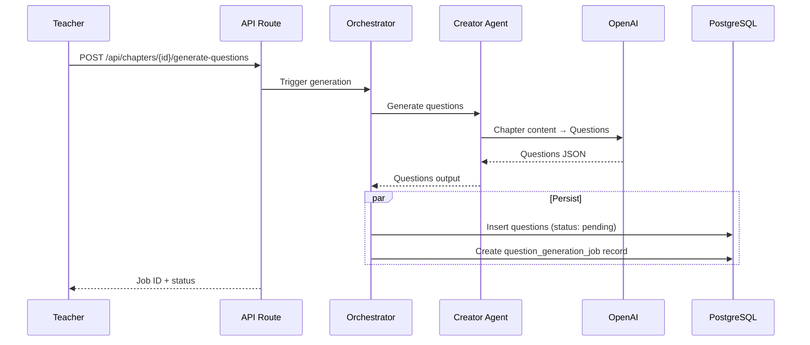
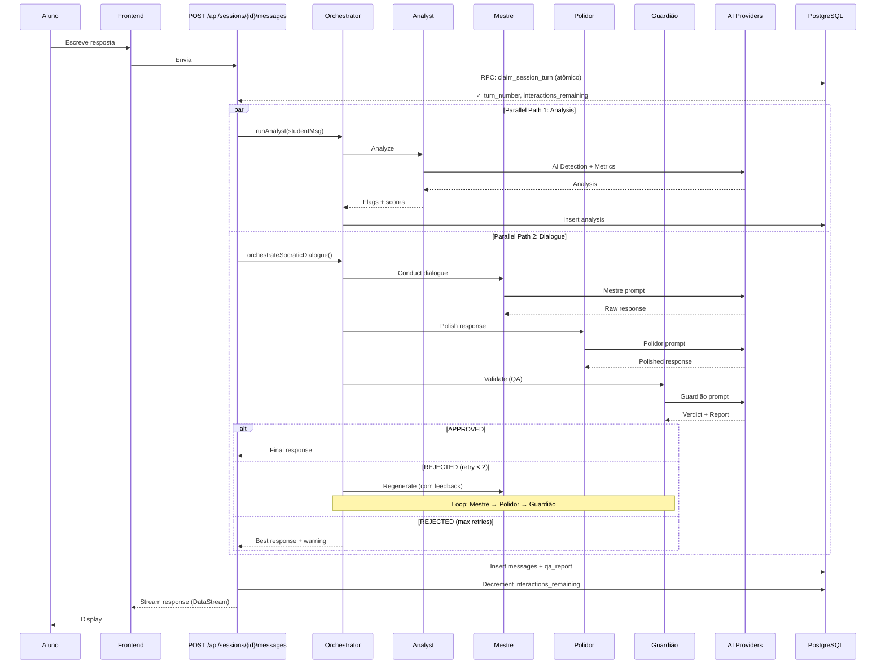

# Pipeline de Agentes IA — Arquitetura Detalhada

**Última atualização:** 2026-02-17
**Versão:** 1.4
**Documentação desdobrada do:** [architecture.md](../architecture.md) (§7) + código real em `packages/agents/src/`

---

## 1. Visão Geral

O pipeline de agentes IA orquestra 6 agentes especializados em sequências predefinidas, controladas pelo **Model Router** multi-provedor. Cada agente é chamado via Vercel AI SDK com fallback automático para garantir confiabilidade.

**Dois pipelines:**
1. **Question Generation** — Geração assíncrona de questões pedagógicas
2. **Socratic Dialogue** — Diálogo em tempo real (Analyst + Mestre + Polidor + Guardião)

---

## 2. Model Router — Routing Multi-provedor

### 2.1 Três Provedores, Um Fallback

```
┌─ OpenAI (gpt-4.1, gpt-4.1-mini)
│  │
│  └─ DeepSeek (deepseek-chat)
│     │
│     └─ Google Gemini 2.5 (fallback)
│
└─ DeepSeek (deepseek-chat)
   │
   └─ Google Gemini 2.0 (fallback)
```

**Arquivo:** `packages/agents/src/model-router.ts`

### 2.2 Tabela de Routing (15 combinações)

| Plano | Mestre | Polidor | Guardião | Detector | Perfilador | Analyst |
|-------|--------|---------|----------|----------|-----------|---------|
| **Essencial** ($0.11/sessão) | gpt-4.1-mini | deepseek | gpt-4.1 | deepseek | deepseek | gpt-4.1-mini |
| **Standard** ($0.29/sessão) | gpt-4.1 | deepseek | gpt-4.1 | deepseek | deepseek | gpt-4.1-mini |
| **Premium** ($0.34/sessão) | gpt-4.1 | gpt-4.1-mini | gpt-4.1 | gpt-4.1-mini | gpt-4.1-mini | gpt-4.1 |

**Otimizações:**
- **Standard + Quiz:** Mestre usa `gpt-4.1-mini` (cost optimization)
- **Fallback:** Se DeepSeek indisponível, tenta próximo na cadeia

### 2.3 API — Seleção de Modelo

```typescript
// packages/agents/src/model-router.ts

export type TenantPlan = "essencial" | "standard" | "premium"
export type AgentRole = "mestre" | "polidor" | "guardiao" | "detector" | "perfilador" | "analyst"

export interface RoutingContext {
  tenantPlan?: TenantPlan
  agentRole: AgentRole
  interactionType?: string  // "quiz" → cost optimization
}

// Puro routing (sem verificar env vars)
export function getModelSpec(ctx: RoutingContext): ModelSpec {
  const plan = ctx.tenantPlan ?? "standard"
  const modelSpec = ROUTING_TABLE[plan][ctx.agentRole]

  // Override: Standard + quiz → mestre usa gpt-4.1-mini
  if (plan === "standard" && ctx.agentRole === "mestre" && ctx.interactionType === "quiz") {
    return spec("openai", "gpt-4.1-mini", OPENAI_KEY)
  }

  return modelSpec
}

// Com fallback chain
export function getModelWithFallback(ctx: RoutingContext): LanguageModel {
  const primary = getModelSpec(ctx)
  const candidates = [primary, ...(FALLBACK_CHAINS[primary.model] ?? [])]

  for (const candidate of candidates) {
    if (hasApiKey(candidate.apiKeyEnv)) {
      return createModelInstance(candidate)
    }
  }

  throw new ModelRouterError(ctx.agentRole, ctx.tenantPlan ?? "standard", candidates.map(c => c.apiKeyEnv))
}
```

### 2.4 Pricing (cost per token)

| Modelo | Input | Output |
|--------|-------|--------|
| **gpt-4.1** | $0.000002 | $0.000008 |
| **gpt-4.1-mini** | $0.0000004 | $0.0000016 |
| **deepseek-chat** | $0.00000027 | $0.0000011 |
| **gemini-2.5-pro** | $0.00000125 | $0.000005 |
| **gemini-2.5-flash** | $0.00000015 | $0.0000006 |

---

## 3. Seis Agentes Especializados

### Tabela Geral

| Agente | Responsabilidade | Input | Output | Modelo (Standard) |
|--------|-----------------|-------|--------|------------------|
| **Mestre** | Diálogo pedagógico, feedback | Msg aluno + contexto | Resposta bruta | gpt-4.1 |
| **Polidor** | Refinamento, remoção de labels | Resposta bruta | Resposta polida | deepseek |
| **Guardião** | Validação de qualidade (6 critérios) | Resposta polida | APPROVED/REJECTED | gpt-4.1 |
| **Detector** | AI Detection, análise linguística | Msg aluno | Probability + verdict | deepseek |
| **Perfilador** | Cognitive profiling (DISC, Enneagram, Big 5) | Interações aluno | Scores + recomendações | deepseek |
| **Analyst** | Métricas de resposta | Msg aluno | Depth, relevance, flags | gpt-4.1-mini |

---

## 4. Pipeline 1: Question Generation

**Trigger:** Professor publica capítulo

**Sequência:** Creator Agent (1 chamada LLM)



**Output Schema (Zod):**
```typescript
interface CreatorOutput {
  questions: Array<{
    text: string
    skill: "analise" | "sintese" | "aplicacao" | "reflexao"
    intention: string
    expected_depth: string
    common_shallow_answer: string
    followup_prompts: string[]
    citations: string[]
  }>
  metadata: {
    questions_generated: number
    skills_covered: string[]
    has_practical_scenario: boolean
  }
}
```

---

## 5. Pipeline 2: Socratic Dialogue (Core)

**Trigger:** Aluno envia mensagem durante sessão

**Sequência:** 4 agentes (Analyst paralelo + Mestre → Polidor → Guardião com retry)

### 5.1 Fluxo Detalhado



### 5.2 Configuração do Pipeline

```typescript
// packages/agents/src/types.ts

export interface AgentPipelineConfig {
  maxRetries: number           // Default: 2
  timeoutMs: number            // Default: 30000ms (30s por agente)
  model: string                // Default: "claude-sonnet-4-5-20250929"
  streaming: boolean           // Default: true
}

export const DEFAULT_PIPELINE_CONFIG: AgentPipelineConfig = {
  maxRetries: 2,
  timeoutMs: 30000,
  model: "claude-sonnet-4-5-20250929",  // Usado apenas se override explícito
  streaming: true,
}
```

### 5.3 Input/Output — Orchestrator

**Input:**
```typescript
export interface OrchestratorInput {
  sessionId: string
  studentMessage: string
  chapterContent: string
  question: Question
  conversationHistory: Message[]  // Mensagens de turnos anteriores (H-2 FIX)
  turnNumber: number             // 1, 2, 3
  interactionsRemaining: number
  tenantPlan?: TenantPlan
  studentProfile?: {             // Optional, para personalização
    big_five?: BigFiveScores
    enneagram?: { type: number }
    disc?: { profile: string }
  }
  model?: string                 // Override default (D24)
}
```

**Output:**
```typescript
export interface PipelineResult {
  response: string               // Resposta final polida
  qaReport: {
    verdict: "APPROVED" | "REJECTED"
    score: number              // 0.0-1.0
    criteriaResults: Record<string, CriterionResult>
    recommendation: string
  }
  usage?: {
    inputTokens: number
    outputTokens: number
  }
}
```

---

## 6. Error Handling

### 6.1 Custom Error Classes

**Arquivo:** `packages/agents/src/errors.ts`

```typescript
export class AgentError extends Error {
  constructor(public agentRole: AgentRole, message: string) {
    super(`[${agentRole}] ${message}`)
  }
}

export class TimeoutError extends AgentError {
  constructor(agentRole: AgentRole, timeoutMs: number) {
    super(agentRole, `Timeout after ${timeoutMs}ms`)
  }
}

export class InvalidOutputError extends AgentError {
  constructor(agentRole: AgentRole, public schemaError: string) {
    super(agentRole, `Invalid output: ${schemaError}`)
  }
}

export class MaxRetriesExceededError extends AgentError {
  constructor(agentRole: AgentRole, maxRetries: number) {
    super(agentRole, `Max retries (${maxRetries}) exceeded`)
  }
}

export class ModelRouterError extends Error {
  constructor(agentRole: AgentRole, plan: TenantPlan, missingKeys: string[]) {
    super(
      `No model available for ${agentRole} (plan: ${plan}). Missing keys: ${missingKeys.join(", ")}`
    )
  }
}
```

### 6.2 Retry Logic

```typescript
// Pseudo-code
async function executeWithRetry<T>(
  agentRole: AgentRole,
  fn: () => Promise<T>,
  maxRetries: number = 2,
  timeoutMs: number = 30000,
): Promise<T> {
  let lastError: Error | null = null

  for (let attempt = 0; attempt <= maxRetries; attempt++) {
    try {
      return await withTimeout(fn(), timeoutMs)
    } catch (err) {
      lastError = err as Error

      if (attempt < maxRetries) {
        console.warn(`[${agentRole}] Retry ${attempt + 1}/${maxRetries}: ${lastError.message}`)
        await delay(1000 * (attempt + 1))  // Exponential backoff
      }
    }
  }

  throw new MaxRetriesExceededError(agentRole, maxRetries)
}
```

---

## 7. Prompts e Schemas

### 7.1 Organização

**Diretório:** `packages/agents/src/prompts/` e `packages/agents/src/schemas/`

| Arquivo | Descrição | Tipo |
|---------|-----------|------|
| `prompts/mestre.ts` | System prompt Mestre (diálogo) | Prompt |
| `prompts/polidor.ts` | System prompt Polidor (refinement) | Prompt |
| `prompts/guardiao.ts` | System prompt Guardião (QA) | Prompt |
| `prompts/detector.ts` | System prompt Detector (AI detection) | Prompt |
| `prompts/perfilador.ts` | System prompt Perfilador (profiling) | Prompt |
| `prompts/analyst.ts` | System prompt Analyst (metrics) | Prompt |
| `schemas/mestre.ts` | Zod schema saída Mestre | Schema |
| `schemas/polidor.ts` | Zod schema saída Polidor | Schema |
| `schemas/guardiao.ts` | Zod schema saída Guardião | Schema |
| `schemas/detector.ts` | Zod schema saída Detector | Schema |
| `schemas/perfilador.ts` | Zod schema saída Perfilador | Schema |
| `schemas/analyst.ts` | Zod schema saída Analyst | Schema |

### 7.2 Exemplo: Mestre (Diálogo Pedagógico)

**Prompt:** `packages/agents/src/prompts/mestre.ts`

```typescript
export const MESTRE_SYSTEM_PROMPT = `
Você é um tutor especializado em diálogo pedagógico socrático.

Sua responsabilidade:
1. Analisar a resposta do aluno em profundidade
2. Oferecer feedback construtivo (sem dar respostas diretas)
3. Formular perguntas que aprofundem reflexão
4. Conectar resposta ao contexto do capítulo

Restrições:
- NUNCA responda a pergunta diretamente
- NUNCA use labels como [Feedback], [Pergunta], etc.
- Mantém tom acolhedor e colaborativo
- Respeita o nível de interações restantes

Personalization: ${buildStudentProfileContext(studentProfile)}
`
```

**Schema:** `packages/agents/src/schemas/mestre.ts`

```typescript
import { z } from "zod"

export const mestreOutputSchema = z.object({
  feedback: z.string().describe("Análise da resposta do aluno"),
  follow_up_question: z.string().describe("Pergunta para aprofundar reflexão"),
  next_direction: z.string().describe("Orientação pedagógica para próximo turno"),
})

export type MestreOutput = z.infer<typeof mestreOutputSchema>
```

---

## 8. Integração com Orchestrator

### 8.1 Inicialização

**Arquivo:** `packages/agents/src/orchestrator.ts`

```typescript
import { generateObject } from "ai"
import { getModelWithFallback } from "./model-router"
import { MESTRE_SYSTEM_PROMPT } from "./prompts/mestre"
import { mestreOutputSchema } from "./schemas/mestre"

// ...

async function runMestre(input: MestreInput, config: AgentPipelineConfig): Promise<MestreOutput> {
  const model = selectModel("mestre", config, input.tenantPlan)

  const { object } = await generateObject({
    model,
    system: MESTRE_SYSTEM_PROMPT,
    prompt: JSON.stringify(input),
    schema: mestreOutputSchema,
    temperature: 0.7,
  })

  return object
}
```

### 8.2 Seleção de Modelo (D24 Override)

```typescript
function selectModel(
  role: AgentRole,
  config: AgentPipelineConfig,
  tenantPlan?: TenantPlan,
): LanguageModel {
  // D24: Override explícito bypassa router
  if (config.model !== DEFAULT_PIPELINE_CONFIG.model) {
    return openai(config.model)
  }

  // Caso normal: usa router
  return getModelWithFallback({ agentRole: role, tenantPlan })
}
```

---

## 9. Testes e Validação

### 9.1 Unit Tests

**Arquivo:** `packages/agents/src/__tests__/model-router.test.ts`

```typescript
describe("Model Router", () => {
  describe("getModelSpec", () => {
    it("returns gpt-4.1 for Standard + Mestre", () => {
      const spec = getModelSpec({
        tenantPlan: "standard",
        agentRole: "mestre",
      })
      expect(spec.provider).toBe("openai")
      expect(spec.model).toBe("gpt-4.1")
    })

    it("returns deepseek for Standard + Polidor", () => {
      const spec = getModelSpec({
        tenantPlan: "standard",
        agentRole: "polidor",
      })
      expect(spec.provider).toBe("deepseek")
    })

    it("optimizes Standard + Quiz: Mestre → gpt-4.1-mini", () => {
      const spec = getModelSpec({
        tenantPlan: "standard",
        agentRole: "mestre",
        interactionType: "quiz",
      })
      expect(spec.model).toBe("gpt-4.1-mini")
    })
  })

  describe("getModelWithFallback", () => {
    it("uses primary model if key available", () => {
      process.env.OPENAI_API_KEY = "test-key"
      const model = getModelWithFallback({
        tenantPlan: "standard",
        agentRole: "mestre",
      })
      expect(model).toBeDefined()
    })

    it("throws ModelRouterError if no keys available", () => {
      delete process.env.OPENAI_API_KEY
      delete process.env.DEEPSEEK_API_KEY
      delete process.env.GOOGLE_API_KEY

      expect(() =>
        getModelWithFallback({
          tenantPlan: "standard",
          agentRole: "mestre",
        })
      ).toThrow(ModelRouterError)
    })
  })
})
```

### 9.2 E2E Tests

**Arquivo:** `apps/web/src/__tests__/session-dialogue.e2e.ts`

```typescript
test("Socratic dialogue pipeline: Mestre → Polidor → Guardião", async ({ page }) => {
  // Setup: Teacher criou curso, aluno está na sessão
  await page.goto("/courses/test-course/chapters/1/session")

  // Input: Aluno responde pergunta
  await page.fill('textarea[placeholder="Escreva sua reflexão..."]', "Acho que a resposta é...")
  await page.click('button:has-text("Enviar")')

  // Espera resposta do tutor (com streaming)
  await page.waitForSelector('[data-testid="tutor-response"]')

  // Validação: Resposta não é rótulada
  const response = await page.textContent('[data-testid="tutor-response"]')
  expect(response).not.toMatch(/\[Feedback\]|\[Pergunta\]/)

  // Validação: Interactions decrementadas
  const counter = await page.textContent('[data-testid="interaction-counter"]')
  expect(counter).toMatch(/2 \/ 3/)
})
```

---

## 10. Documentação de Código-Fonte

| Arquivo | Linhas | Descrição |
|---------|--------|-----------|
| `orchestrator.ts` | ~500 | Pipeline principal, coordenação de agentes |
| `model-router.ts` | ~200 | Routing, fallback, pricing |
| `types.ts` | ~150 | Type definitions, interfaces |
| `errors.ts` | ~80 | Custom error classes |
| `prompts/*.ts` | ~50 cada | System prompts (6 arquivos) |
| `schemas/*.ts` | ~30 cada | Zod output schemas (6 arquivos) |

**Total:** ~1500 linhas de código agent pipeline

---

## 11. Documentação Relacionada

- **[system-overview.md](system-overview.md)** — Infraestrutura e stack geral
- **[database-schema.md](database-schema.md)** — Schema onde agentes persistem dados
- **[decisions/README.md](decisions/README.md)** — ADRs relacionados (D24 override, etc.)

---

**Última atualização:** 2026-02-17 | **Versão:** 1.4
