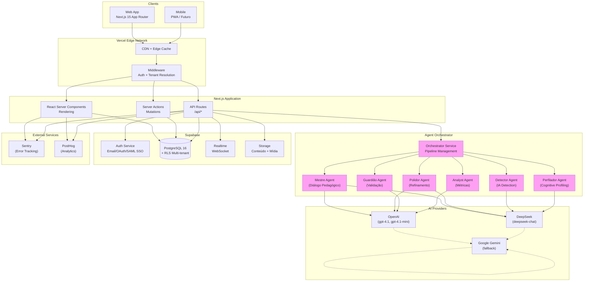

# Visão Técnica — exímIA Academy

**Última atualização:** 2026-02-17
**Versão:** 1.4
**Documentação desdobrada do:** [architecture.md](../architecture.md) (§1, §2, §3, §4, §5, §8, §13)

---

## 1. Resumo Executivo

A exímIA Academy é uma **plataforma LMS SaaS multi-tenant** que integra nativamente agentes de IA para transformar aprendizado passivo em aplicação prática de conhecimento através do **diálogo pedagógico**.

**Stack:** Next.js 15 (App Router) + Supabase (PostgreSQL + RLS) + Vercel (hosting) + Model Router multi-provedor (OpenAI + DeepSeek + Gemini).

**Modo:** Operação **exclusivamente corporativa** — universidades corporativas e academias de treinamento empresarial. Isolamento multi-tenant via Row-Level Security (RLS) no PostgreSQL.

---

## 2. Infraestrutura e Hosting

### 2.1 Decisão: Vercel + Supabase

| Critério | Vercel + Supabase | AWS Full Stack | Self-hosted |
|----------|-------------------|----------------|-------------|
| Time-to-market | ⭐⭐⭐⭐⭐ | ⭐⭐ | ⭐ |
| Developer Experience | ⭐⭐⭐⭐⭐ | ⭐⭐⭐ | ⭐⭐ |
| Multi-tenant (RLS) | Nativo | Manual | Manual |
| Real-time | Nativo (Realtime) | AppSync/WebSocket | Manual |
| Auth + SSO | Nativo (Auth + SAML) | Cognito | Manual |
| Custo inicial | Baixo ($25-50/mês) | Médio ($100+/mês) | Alto (infra + DevOps) |
| Escalabilidade | Serverless | Muito alta | Depende |
| Lock-in risk | Médio | Alto | Baixo |

**Rationale:**
- Next.js é nativo do Vercel → deploy otimizado, preview deploys, edge functions
- Supabase oferece PostgreSQL + RLS (multi-tenant) + Auth (SSO) + Realtime + Storage num único serviço
- AI SDK simplifica streaming de respostas LLM para o diálogo
- Custo inicial baixo permite validação de MVP rapidamente
- Migração para infraestrutura dedicada é viável (PostgreSQL + Next.js são padrões)

### 2.2 Serviços Principais

| Serviço | Provider | Propósito |
|---------|----------|-----------|
| **Frontend Hosting** | Vercel | Next.js SSR/SSG + Edge |
| **Database** | Supabase (PostgreSQL 16) | Dados + RLS multi-tenant |
| **Auth** | Supabase Auth | Login, SSO (SAML), roles |
| **Storage** | Supabase Storage | Conteúdo, mídia, uploads |
| **Realtime** | Supabase Realtime | Chat updates, notificações |
| **Serverless Functions** | Vercel Functions | API routes, orquestração |
| **AI Models** | OpenAI + DeepSeek + Google | Agentes de diálogo pedagógico |
| **Error Tracking** | Sentry | Fullstack (front + back) |
| **Product Analytics** | PostHog | Métricas de uso, session replay |

---

## 3. Tech Stack Detalhado

| Categoria | Tecnologia | Versão | Rationale |
|-----------|-----------|--------|-----------|
| **Frontend** | TypeScript + Next.js 15 (App Router) | 5.x / 15 | Type safety fullstack, RSC para performance |
| **UI** | @eximia/ui (shadcn/ui) | latest | 29 componentes acessíveis, design tokens Tailwind v4 |
| **Styling** | Tailwind CSS + CSS Variables | 4.x | Utility-first, integração tokens semânticos |
| **State (Server)** | TanStack Query | 5.x | Cache inteligente, sync de dados |
| **State (Client)** | Zustand | 5.x | Simples, performático, sem boilerplate |
| **Backend** | Node.js + TypeScript | 18+ | API routes, type safety end-to-end |
| **ORM** | Drizzle ORM | latest | SQL-first, type inference superior, performático |
| **Database** | PostgreSQL 16 (via Supabase) | 16 | RLS nativo, extensível, maduro |
| **Cache** | Vercel KV (Redis) | - | Serverless, low latency, sessões |
| **AI Pipeline** | Vercel AI SDK | 4.x | Streaming nativo, tool calling, multi-provider |
| **Testing (Unit)** | Vitest | 3.x | Rápido, compatível Jest, ESM |
| **Testing (Component)** | Testing Library | latest | Testa comportamento, padrão React |
| **Testing (E2E)** | Playwright | latest | Multi-browser, confiável, ótimo DX |
| **Linting** | Biome | latest | 100x mais rápido que ESLint + Prettier |
| **Monorepo** | Turborepo + pnpm | latest / 9.x | Build paralelo, workspace-friendly |
| **CI/CD** | GitHub Actions | - | Integração Vercel + Supabase nativa |

---

## 4. Diagrama de Infraestrutura



---

## 5. Padrões Arquiteturais

### 5.1 App Router + React Server Components (RSC)

**Pattern:** Componentes renderizados no servidor por padrão, client components apenas onde necessário.

**Benefício:** Performance superior — menos JavaScript no cliente, cache automático.

**Uso:**
- Páginas de conteúdo (`/courses/*`) → RSC por padrão
- Chat socrático (`/courses/[courseId]/chapters/[chapterId]/session`) → SSR + streaming
- Dashboards → RSC com Server Actions para filtros

### 5.2 Server Actions para Mutations

**Pattern:** Formulários e mutations via Next.js Server Actions, eliminando necessidade de API routes para CRUD simples.

**Benefício:** Menos código, type-safe end-to-end, progressive enhancement.

**Exemplos:**
- Criar/editar capítulos
- Atualizar perfil do aluno
- Marcar questões como resolvidas

### 5.3 API Routes para Orquestração de Agentes

**Pattern:** Pipeline de agentes via API routes dedicadas com streaming (SSE).

**Benefício:** Agentes LLM precisam de orquestração complexa (retry, timeout, fallback) que não cabe em Server Actions.

**Endpoints críticos:**
- `POST /api/sessions/{id}/messages` — Diálogo socrático (streaming)
- `POST /api/chapters/{id}/generate-questions` — Geração de questões

### 5.4 Row-Level Security (RLS) para Multi-tenant

**Pattern:** Isolamento de dados por tenant no nível do PostgreSQL, não da aplicação.

**Benefício:** Segurança garantida pelo banco — impossível acessar dados de outro tenant mesmo com bug no código.

**Implementação:** Todas as 17 tabelas têm coluna `tenant_id` com policies RLS que usam `auth_tenant_id()` (função helper).

Ver [database-schema.md](database-schema.md#multi-tenant-isolation) para detalhes.

### 5.5 Repository Pattern com Drizzle ORM

**Pattern:** Camada de acesso a dados abstraída, queries type-safe.

**Benefício:** Testabilidade, type inference superior, flexibilidade para trocar banco.

**Estrutura:**
```
packages/database/
├── src/
│   ├── schema/          # Drizzle table definitions (17 tabelas)
│   ├── migrations/      # SQL migrations
│   └── repositories/    # Query builders
```

### 5.6 Pipeline Pattern para Agent Orchestrator

**Pattern:** Cada agente é um step num pipeline configurável com retry, timeout e fallback.

**Benefício:** Agentes são compostos e sequenciais — pipeline pattern modela isso naturalmente.

**Dois pipelines:**
1. **Question Generation** — Creator Agent (conteúdo → questões)
2. **Socratic Dialogue** — Analyst + Mestre + Polidor + Guardião (com retry até 2x)

Ver [ai-pipeline.md](ai-pipeline.md) para detalhes.

### 5.7 Event-Driven Analytics

**Pattern:** Eventos de interação aluno-IA capturados e processados assincronamente.

**Benefício:** Analytics não bloqueia UX; eventos permitem processamento posterior (reprocessamento, retratos).

**Eventos capturados:**
- `session.started`
- `session.message_sent`
- `session.completed`
- `analysis.created`
- `qa_report.generated`

### 5.8 Feature Flags por Tenant

**Pattern:** Funcionalidades ativadas/desativadas por tenant via `tenant.settings.features`.

**Benefício:** Configuração granular por tenant sem branches de código.

**Exemplo:**
```typescript
if (tenant.settings.features.ai_detection) {
  // ativar análise de IA
}
```

---

## 6. Estrutura de Monorepo

```
exímIA Academy/
├── apps/
│   └── web/                          # Next.js 15 application
│       ├── src/
│       │   ├── app/                  # App Router
│       │   │   ├── (auth)/
│       │   │   ├── (platform)/
│       │   │   ├── api/              # 50+ API routes
│       │   │   └── layout.tsx
│       │   ├── components/           # UI + domain components
│       │   ├── hooks/                # React hooks
│       │   ├── lib/                  # Utils + Supabase clients
│       │   ├── middleware.ts         # Auth + tenant resolution
│       │   └── styles/
│       └── package.json
├── packages/
│   ├── agents/                       # Agent Orchestrator + prompts
│   │   └── src/
│   │       ├── orchestrator.ts       # Main pipeline
│   │       ├── model-router.ts       # Multi-provider routing
│   │       ├── prompts/              # 6 templates (Mestre, Polidor, etc.)
│   │       ├── schemas/              # Zod output schemas
│   │       ├── types.ts              # Type definitions
│   │       └── errors.ts             # Custom errors
│   ├── database/                     # Drizzle ORM + schema
│   │   └── src/
│   │       ├── schema/               # 17 tabelas Drizzle
│   │       └── repositories/         # Query builders
│   ├── shared/                       # Shared types + validators
│   │   └── src/
│   │       ├── types/
│   │       ├── validators/           # Zod schemas
│   │       └── constants/
│   └── ui/                           # Design system (@eximia/ui)
│       ├── src/
│       │   ├── components/           # 29 componentes
│       │   ├── tokens/               # Theme tokens
│       │   └── index.ts
│       └── package.json
├── supabase/
│   └── migrations/                   # 28+ SQL migrations
├── docs/
│   ├── architecture/
│   │   ├── system-overview.md        # Este arquivo
│   │   ├── ai-pipeline.md
│   │   ├── database-schema.md
│   │   ├── decisions/
│   │   │   ├── README.md
│   │   │   ├── ADR-001-*.md
│   │   │   └── ADR-002-*.md
│   │   └── project-decisions/
│   └── ...
├── biome.json                        # Lint + format
├── turbo.json                        # Monorepo pipeline
└── pnpm-workspace.yaml               # Workspace config
```

---

## 7. Fluxo de Dados — Diálogo Socrático

```
1. Aluno envia resposta
   ↓
2. Next.js Frontend → POST /api/sessions/{id}/messages
   ↓
3. Middleware: Resolve tenant_id + auth
   ↓
4. Claim session turn atomicamente (RPC: claim_session_turn)
   ↓
5. Parallel: Analyst Agent (análise de IA) + Pipeline:
      a) Mestre Agent (diálogo)
      b) Polidor Agent (refinamento)
      c) Guardião Agent (validação)
      d) Se REJECTED → retry (max 2x)
   ↓
6. Persist: messages, analyses, qa_reports
   ↓
7. Stream response (DataStream protocol) → Frontend
   ↓
8. Frontend: Display response + update interaction counter
```

---

## 8. Multi-tenant: Row-Level Security (RLS)

### 8.1 Isolamento por Tenant

**Estratégia:** Todas as 17 tabelas têm coluna `tenant_id`. PostgreSQL garante isolamento no nível do banco via policies RLS.

**Helper Function:**
```sql
CREATE OR REPLACE FUNCTION auth_tenant_id() RETURNS UUID AS $$
  SELECT tenant_id FROM users WHERE id = auth.uid();
$$ LANGUAGE sql SECURITY DEFINER STABLE;
```

**Policy Pattern:**
```sql
CREATE POLICY tenant_isolation ON users
  FOR ALL
  USING (tenant_id = auth_tenant_id());
```

**Tabelas com RLS (17 tabelas):**
1. users
2. courses
3. chapters
4. questions
5. enrollments
6. sessions
7. messages
8. analyses
9. qa_reports
10. areas
11. user_areas
12. content_ingestions
13. question_generation_jobs
14. learner_profiles
15. platform_audit_log
16. (+ 2 outras)

### 8.2 Tenant Resolution

**Estratégia:** Middleware Next.js extrai `tenant_id` do contexto (subdomain ou path) e injeta no header.

**Métodos suportados:**
- **Subdomain:** `demo.eximia.academy` → extrai `demo`
- **Path prefix:** `/t/demo/courses` → extrai `demo`

**Implementação:**
```typescript
// apps/web/src/middleware.ts
export function middleware(request: NextRequest) {
  const hostname = request.headers.get('host') || ''
  const subdomain = hostname.split('.')[0]

  const response = NextResponse.next()
  response.headers.set('x-tenant-slug', subdomain)
  return response
}
```

---

## 9. Deployment

### 9.1 Pipeline CI/CD

**Tool:** GitHub Actions + Vercel + Supabase

**Stages:**
1. **Build:** Turborepo cache, linting (Biome), type checking
2. **Test:** Vitest (unit) + Playwright (E2E)
3. **Deploy Preview:** Preview Vercel deployment
4. **Deploy Production:** Vercel → CDN edge

### 9.2 Migrations Database

**Tool:** Drizzle Migrations via Supabase CLI

```bash
# Generate migration from schema changes
pnpm db:generate

# Apply migrations to staging/production
pnpm db:migrate
```

### 9.3 Environment Variables

**Vercel Secrets:**
```
OPENAI_API_KEY
DEEPSEEK_API_KEY
GOOGLE_API_KEY
SUPABASE_URL
SUPABASE_ANON_KEY
SUPABASE_SERVICE_ROLE_KEY
SENTRY_DSN
POSTHOG_API_KEY
```

---

## 10. Documentação Relacionada

- **[ai-pipeline.md](ai-pipeline.md)** — Arquitetura completa dos agentes, Model Router, pipelines
- **[database-schema.md](database-schema.md)** — ER diagram, 17 tabelas, RLS policies
- **[decisions/README.md](decisions/README.md)** — ADRs (Architecture Decision Records)
- **[../README.md](../README.md)** — Visão geral do projeto (raiz)

---

**Última atualização:** 2026-02-17 | **Versão:** 1.4
